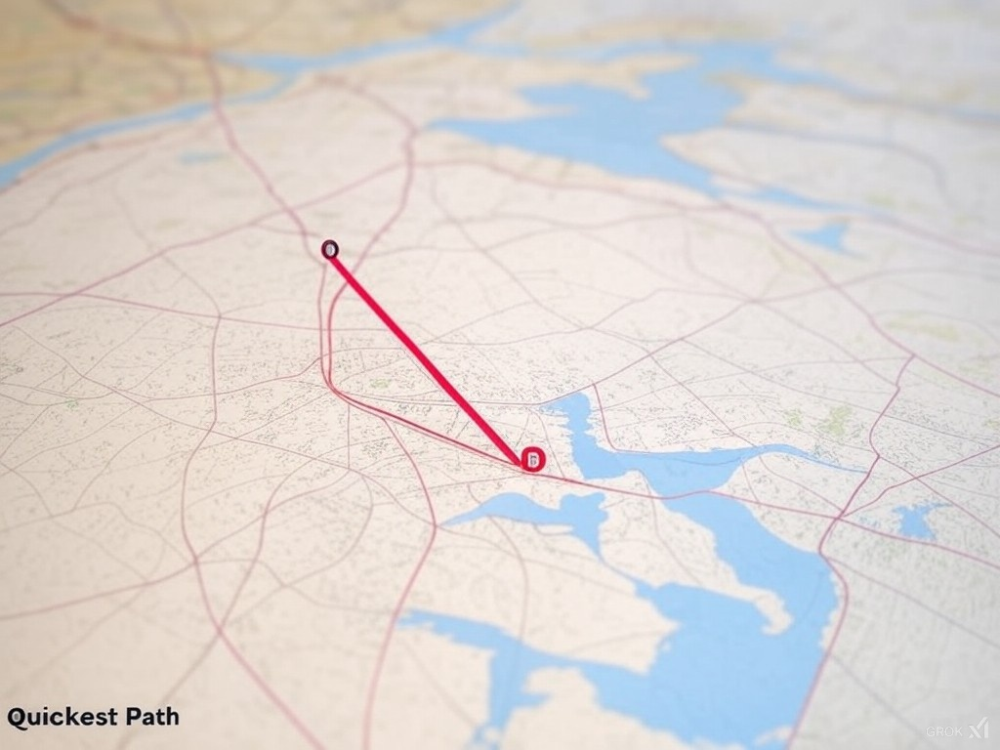
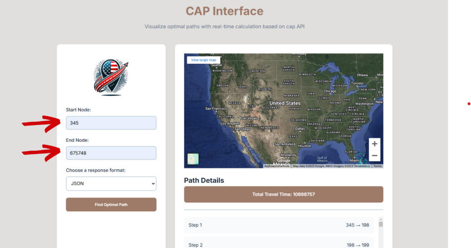
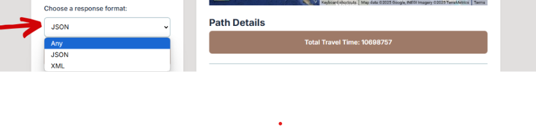
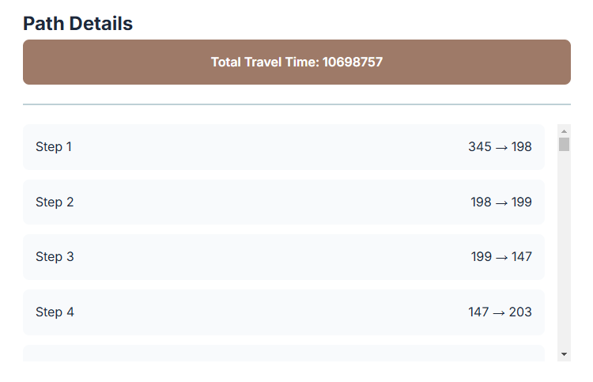

# User Manual for 2024-2025 Project 3: Quickest Path

| Name           | date      | role |
| -------------- | --------- |------|
| Alexandre Bopp | 1/13/2025 | Technical Writer |
| Robin Goumy    | 1/21/2025 | Program Manager |
| Jason Grosso   |     -     | Quality Assurance |



---

## 1. Introduction

### **Project Overview**

This user manual provides guidance on how to operate and interact with the **Quickest Path Calculator** software. It calculates the fastest road between two landmarks in the United States using a large dataset of connected nodes. Its primary applications include trip planning, route optimization, and travel time reporting.

### **Audience**

This user manual is designed for everyone, no technical requirements or computer-related background are expected. The software is built to be easy to use, with a simple interface that doesn't require technical knowledge. Once installed, the tool is ready for use and allows you to perform your tasks without needing to understand complex systems.

#### **Key Points for the Audience**:

| **Feature**             | **Description**                                                                          |
| ----------------------- | ---------------------------------------------------------------------------------------- |
| **User-friendly**       | The software is simple to use, with a clean interface and no technical jargon.           |
| **Easy setup**          | The software can be set up quickly with easy-to-follow instructions.                     |
| **Straightforward use** | After installation, using the software is intuitive and requires no technical knowledge. |

### **Scope**

The software provides a **REST API** that allows users to find travel times and calculate optimal routes between landmarks. By using a CSV dataset of road connections, the API processes user inputs and returns travel data in both XML and JSON formats. This enables easy integration with other systems and allows users to retrieve and interpret travel information in a way that suits their needs.

## 2. Prerequisites

- **Basic Requirements**:

  - Input: Keyboard and mouse/trackpad.
  - Device: PC or laptop.
  - Power: Electricity or battery.
  - Network: Internet for initial setup.

- **Minimum System Requirements**:

  | **Configuration**    | **Windows**                                                                           | **Mac**                                                                               |
  | -------------------- | ------------------------------------------------------------------------------------- | ------------------------------------------------------------------------------------- |
  | **Operating System** | Windows 10 (64-bit) or later                                                          | macOS Mojave (10.14) or later                                                         |
  | **Processor**        | Intel Core i3 (8th Gen) or AMD Ryzen 3                                                | Apple M1 or Intel Core i5                                                             |
  | **RAM**              | 4 GB minimum, 8 GB recommended for smooth performance                                 | 4 GB minimum, 8 GB recommended for smooth performance                                 |
  | **Storage**          | 100 MB of free space for software and dataset; SSD recommended for faster performance | 100 MB of free space for software and dataset; SSD recommended for faster performance |
  | **Graphics**         | Integrated graphics card (no dedicated GPU required)                                  | Integrated graphics (Apple M1 has integrated GPU)                                     |
  | **Network**          | Stable internet connection for API calls and software setup                           | Stable internet connection for API calls and software setup                           |
  | **Additional Notes** | Software installation and dataset management may require admin privileges             | Software installation and dataset management may require admin privileges             |

- **How to Check Your PC Components**

  - **Windows**:

    1. Press `Windows + R` to open the Run dialog.
    2. Type `dxdiag` and press Enter.
    3. In the DirectX Diagnostic Tool, you can find your **Processor**, **Memory (RAM)**, and **Graphics** listed.

  - **Mac**:

    1. Click the Apple logo in the top-left corner.
    2. Select **About This Mac**.
    3. The window that appears will show details about your **Processor**, **Memory (RAM)**, **Storage**, and **Graphics**.

  These steps will help you confirm your system's specifications for ensuring compatibility with the software.

- **Data File**(optional):

  - **USA-roads.csv**:  
    This is a file that contains information about roads and travel times between landmarks. It’s very important for the software to work correctly.
    - You can download it [here](#). Once you have it, keep it in the same folder as the software.

## 3. Installation Guide

### Download the Software 

To start, you need to get the software on your computer. There are two options for this:

#### Using Git (recommended if you have Git installed)

1. Open the **Command Prompt** (Windows) or **Terminal** (Mac).  
2. Type the following command to download the software:  

  ```bash
      git clone https://github.com/algosup/2024-2025-project-3-quickest-path-team-5
  ```

   *Tip: If you don’t have Git installed, please visit this [link](https://git-scm.com/book/en/v2/Getting-Started-Installing-Git) to install Git.*

### Manual Download

1. Go to the [GitHub repository](https://github.com/algosup/2024-2025-project-3-quickest-path-team-5) and click **Download ZIP**.  
2. Extract the ZIP file to a location on your computer.  

   *Note: Make sure the folder you download is **easy** to access.*

---

### Setting Up the Environment 

To run the software, you need to install the following dependencies:

#### CMake (Required)

CMake is a tool that simplifies the compilation of complex projects.  
Download and install the version suitable for your system (Windows, Mac, Linux) from [CMake Download](https://cmake.org/download).

#### Clang (C++ Compiler)

- **On Mac**, install Clang via the LLVM package:
  
  ```bash
    brew install llvm
  ```

- **On Windows**, use Chocolatey to install Clang:  

  ```bash
    choco install llvm
  ```

#### Crow Web Framework

You’ll need to install the Crow web framework.  
Follow the Crow installation guide for CMake-based projects.

#### MinGW (on Windows for Makefiles)

If you’re working on Windows and need mingw32-make, install MinGW.  
Instructions can be found in the MinGW installation guide.

---

### Building the Project

#### Generate Build Files Using CMake

Create a build directory and navigate into it:  

```bash
  mkdir build
  cd build
  ```

- **For Windows (MinGW)**:  
  
  ```bash
    cmake -S .. -B . -G "MinGw Makefiles  
  ```

- **For Mac/Linux**:  

  ```bash
    cmake -S .. -B .
  ```

---

### Compile the Project

- **For Windows (with MinGW)**:

  ```bash
    mingw32-make
  ```

- **For Mac/Linux**:  
  
  ```bash
    make
  ```

---

### Running the Software

#### Running cap

After building, navigate to the bin directory and run the software:  

  ```bash
    cd ../bin
    ./cap
  ```

#### Running DAG (Directed Acyclic Graph) Validation

If you want to run the DAG validation:  

Navigate to the `dag_graph_validator` directory:  

  ```bash
    cd dag_graph_validator
  ```

Run the CMake commands to build (consider your OS: Windows or Mac/Linux).  

Then, run the validation tool:  

  ```bash
    cd bin
    ./dag
  ```

---

### Running Tests

#### Test Suite

To verify everything is working correctly, run the test suite.

Navigate to the test directory:  

  ```bash
    cd /Yourpath/to/tests
  ```

Run the tests:  

  ```bash
    ./tests
  ```

## 4. Usage Instructions

### Finding the Quickest Path

- **How It Works**  
   The software calculates the shortest route between two landmarks using the provided road network data.

- **Understanding the Output**

  - Travel Time: Displays the estimated time to traverse the path.
  - Path: Lists the sequence of landmarks to follow for the route.

- **The interface is easy to use, and takes the form of a single page containing all the information.**

  1. Enter your two landmarks, your source and your destination

      

  2. Choose your download format

      

  3. Submit your request

      

  4. Waiting to access the travel times and the steps

      

## 5. Troubleshooting

### Common Issues

| **Issue**                          | **Problem**                                                                 | **Solution**                                                                                           |
|------------------------------------|-----------------------------------------------------------------------------|-------------------------------------------------------------------------------------------------------|
| **Missing or Incorrect `USA-roads.csv` File** | The file is missing or doesn't match the required format.                  | 1. Ensure the file is in the same folder as the software. <br> 2. The file should look like: `Landmark_A_ID, Landmark_B_ID, Time`. <br>  |
| **API Not Responding**             | The server is not running.                                                 | 1. Check if the server is running by typing: <br> `curl http://localhost:<PORT>/api/path?source_id=1&destination_id=5` <br> 2. Ensure the server is on port 8080. <br> 3. Ensure no other program is using the same port. |
| **Unexpected Results**             | The API is giving wrong results.                                           | 1. Double-check the IDs you're using. <br> 2. Ensure the dataset is correct.                          |
| **Bad Request**              | Missing or incorrect data in your request.                                 | 1. Ensure you include both `source_id` and `destination_id`. <br> 2. Example: <br> `http://localhost:<PORT>/api/path?source_id=1&destination_id=5` |
| **Not Found**                | The requested resource doesn't exist.                                      | 1. Verify the URL and endpoint are correct.                                                            |
| **Internal Server Error**   | Something went wrong on the server.                                        | 1. Check the server logs for specific errors. <br> 2. Ensure the `USA-roads.csv` file is correct.    |
| **Server Fails to Start**          | The server won't run.                                                      | 1. Check that you have installed all required dependencies. <br> 2. Look at error messages for missing files or libraries. |
| **Slow API Response**              | The response takes too long.                                               | 1. Ensure your dataset doesn't have unnecessary data. <br> 2. Try limiting how many requests are being made at once. |
| **Permission Denied Errors**       | You can't access files or run commands.                                    | 1. Run the software as an administrator (use `sudo` on Linux). <br> 2. Ensure the `USA-roads.csv` file can be read. |

## 6. FAQs

### **Common Questions**

- **Q: How does the software handle invalid inputs?**  
  - **A:** Returns an error message indicating the issue.

- **Q: Can additional data be added to **USA-roads.csv**?**  
  - **A:** Yes, but it must follow the required format.

- **Q: What format should the input data files follow?**  
  - **A:** All input files must be CSV files with specific columns: `StartNode`, `EndNode`, and `Distance`. Refer to the provided `USA-roads.csv` for an example.

- **Q: What happens if the data file is missing or corrupted?**  
  - **A:** The software will notify the user and exit gracefully with an error message.

- **Q: Can I run the program on systems other than Linux?**  
  - **A:** Yes, the program is compatible with Windows, macOS, and Linux, but you need to ensure you have the necessary build tools installed (e.g., CMake and a compatible compiler).

- **Q: How are performance metrics calculated?**  
  - **A:** The program calculates the total travel time, shortest path, and compliance with the 10% approximation rule during the testing phase.

- **Q: Is it possible to visualize the generated paths?**  
  - **A:** Currently, the program does not include visualization, but you can export the results for use in third-party tools.

- **Q: Can I add more test cases?**  
  - **A:** Yes, you can modify the test suite by editing the corresponding test files in the source code.

- **Q: Does the software support weighted graphs with different cost metrics?**  
  - **A:** Yes, you can modify the input data to include weights (e.g., distance, time, cost) as long as it aligns with the required format.

- **Q: How do I reset or rebuild the project?**  
  - **A:** Delete the `build` directory and rerun the following commands:
  
    ```bash
    cmake -S . -B build
    cd build
    make
    ```

- **Q: Where can I report bugs or request features?**  
  - **A:** Please use the project's GitHub repository issue tracker or contact the development team directly.

## 7. Legal Mentions

### 1. Copyright  

  All content within this document, including text, images, and code snippets, is the property of Team 5 and is protected under applicable copyright laws. Unauthorized reproduction, distribution, or modification of this document is strictly prohibited.

  © 2025 Team 5. All rights reserved.

### 2. License & Usage  

This document is provided for informational purposes only. It may not be copied, shared, or used for commercial purposes without prior written consent from Team 5.

  For more information on copyright and usage, you may refer to the following legal articles:

- **Berne Convention for the Protection of Literary and Artistic Works** 
- **EU Directive 2001/29/EC**
  
### 3. Liability Disclaimer  

  Team 5 provides this software free of charge, without collecting personal data. The software is offered "as is," with no express or implied warranties. While we strive for accuracy and reliability, we do not guarantee uninterrupted or error-free operation. Users are responsible for their own use of the software. Team 5 shall not be liable for any indirect or incidental issues arising from its use, except in cases of gross negligence or willful misconduct.

### 4. Modifications & Updates  

  Team 5 reserves the right to modify, update or delete any part of its services, whether documents or software.

### 5. Contact Information  

  | **Category**        | **Details**                                                 |
  |---------------------|-------------------------------------------------------------|
  | **Github issue**    | Create an issue on github                                   |
  | **Company Name**   | Team 5                                                       |
  | **Response Time**  | We aim to respond within 24-48 hours.                        |
  | **Work Time**      | Monday to Friday, 9 AM - 5 PM (CET - Central European Time). |
  | **Support Topics** | Bugs, Feature Requests, General Inquiries, Setup Assistance. |

## 8. Appendix

### Glossary:

- **Landmark**: A point of interest in the graph (e.g., city, intersection). It’s like a location or stop along your journey.

- **CSV (Comma-Separated Values)**: A simple text file format where data is stored in rows and columns. Each value is separated by a comma. It’s similar to a spreadsheet, but without the rows and columns you see in Excel.

- **API (Application Programming Interface)**: A set of rules that lets different software applications talk to each other. It’s like a menu at a restaurant where the software makes a request and gets a response back.

- **Build Directory**: A folder where temporary files are stored during the process of making a program. Think of it as a workspace where all the pieces of your program come together.

- **Makefiles**: A set of instructions that tell the computer how to compile (build) the software. They’re like a recipe with step-by-step instructions on how to make the program.

- **HTTP Server**: A program that allows other software, like a web browser, to interact with your system. It’s like a waiter that brings requests from the internet and delivers responses back.

- **Git**: A tool that helps manage and track changes in software. It’s like a time machine for your code, allowing you to go back to earlier versions if something goes wrong.

- **Dataset**: A collection of information or data that the software uses to calculate routes or times. It’s like a map with all the road information you need for your trip.

- **Compile**: The process of turning the code you’ve written into a program that can be run on your computer. It’s like putting ingredients together to make a meal.

- **Terminal**: A program where you type commands to interact with your computer. It’s like talking directly to your computer using text.

- **Executable File**: A type of file that contains a program that can be run on your computer. It’s like a machine that performs a task when you click it.

- **Environment Variables**: Special settings that help your system know where to find certain tools or files. They’re like a map that tells your computer where to look for things it needs.
