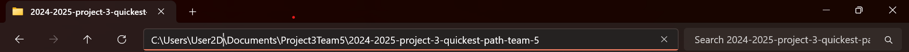

# User Manual for 2024-2025 Project 3: Call for Tender

| Name           | date      |
| -------------- | --------- |
| Alexandre Bopp | 1/13/2025 |


---

## 1. Introduction

### **Project Overview**

This user manual provides guidance on how to operate and interact with the **Quickest Path Calculator** software. It calculates the fastest road between two landmarks in the United States using a large dataset of connected nodes. Its primary applications include trip planning, route optimization, and travel time reporting.

### **Audience**

This user manual is designed for everyday workers with no technical or computer-related background. The software is built to be easy to use, with a simple interface that doesn't require technical knowledge. Once installed, the tool is ready for use and allows you to perform your tasks without needing to understand complex systems.

#### **Key Points for the Audience**:

| **Feature**             | **Description**                                                                          |
| ----------------------- | ---------------------------------------------------------------------------------------- |
| **User-friendly**       | The software is simple to use, with a clean interface and no technical jargon.           |
| **Easy setup**          | The software can be set up quickly with easy-to-follow instructions.                     |
| **Straightforward use** | After installation, using the software is intuitive and requires no technical knowledge. |

### **Scope**

The software provides a **REST API** that allows users to find travel times and calculate optimal routes between landmarks. By using a CSV dataset of road connections, the API processes user inputs and returns travel data in both XML and JSON formats. This enables easy integration with other systems and allows users to retrieve and interpret travel information in a way that suits their needs.

## 2. Prerequisites

- **Basic Requirements**:

  - Input: Keyboard and mouse/trackpad.
  - Device: PC or laptop.
  - Power: Electricity or battery.
  - Network: Internet for initial setup.

- **Minimum System Requirements**:

  | **Configuration**    | **Windows**                                                                           | **Mac**                                                                               |
  | -------------------- | ------------------------------------------------------------------------------------- | ------------------------------------------------------------------------------------- |
  | **Operating System** | Windows 10 (64-bit) or later                                                          | macOS Mojave (10.14) or later                                                         |
  | **Processor**        | Intel Core i3 (8th Gen) or AMD Ryzen 3                                                | Apple M1 or Intel Core i5                                                             |
  | **RAM**              | 4 GB minimum, 8 GB recommended for smooth performance                                 | 4 GB minimum, 8 GB recommended for smooth performance                                 |
  | **Storage**          | 100 MB of free space for software and dataset; SSD recommended for faster performance | 100 MB of free space for software and dataset; SSD recommended for faster performance |
  | **Graphics**         | Integrated graphics card (no dedicated GPU required)                                  | Integrated graphics (Apple M1 has integrated GPU)                                     |
  | **Network**          | Stable internet connection for API calls and software setup                           | Stable internet connection for API calls and software setup                           |
  | **Additional Notes** | Software installation and dataset management may require admin privileges             | Software installation and dataset management may require admin privileges             |

- **How to Check Your PC Components**

  - **Windows**:

  1. Press `Windows + R` to open the Run dialog.
  2. Type `dxdiag` and press Enter.
  3. In the DirectX Diagnostic Tool, you can find your **Processor**, **Memory (RAM)**, and **Graphics** listed.

  - **Mac**:

  1. Click the Apple logo in the top-left corner.
  2. Select **About This Mac**.
  3. The window that appears will show details about your **Processor**, **Memory (RAM)**, **Storage**, and **Graphics**.

  These steps will help you confirm your system's specifications for ensuring compatibility with the software.

- **Software Requirements**:

  1. **C++ Compiler**:  
     You will need a program called GCC to run the software. This is a tool that helps your computer understand and execute the code.

     - To install it, just click [here to download GCC](https://gcc.gnu.org/) and follow the easy steps on the website.

  2. **HTTP Server**:  
     An HTTP server is needed to make the software work on your computer. If you don't already have one, we suggest using **Apache** or **Nginx**.

     - Don’t worry, these servers are widely used and have easy-to-follow [guides](https://www.ionos.fr/digitalguide/serveur/configuration/installer-un-serveur-apache-nos-conseils/). 

- **Data File**:

  - **USA-roads.csv**:  
    This is a file that contains information about roads and travel times between landmarks. It’s very important for the software to work correctly.
    - You can download it [here](#). Once you have it, keep it in the same folder as the software.

## 3. Installation Guide

### 1. **Download the Software**

To start, you need to get the software on your computer. There are two options for this:

#### Case 1: **Using Git** (recommended if you have Git installed):

1. Open the **Command Prompt** (Windows) or **Terminal** (Mac).
2. Type the following command to download the software:

   ```bash
   git clone https://github.com/algosup/2024-2025-project-3-quickest-path-team-5
   ```

   Tip: If you don’t have Git installed, please visit this [link](https://git-scm.com/book/en/v2/Getting-Started-Installing-Git) to install Git.

#### Case 2: **Manual** Download:

Go to the [GitHub repository](https://github.com/algosup/2024-2025-project-3-quickest-path-team-5) and click Download ZIP. Extract the ZIP file to a location on your computer.
Note: Make sure the folder you download is <strong>easy</strong> to access.

### 2. Setting up the Environment:

Before you can run the software, you need a few programs installed on your computer. Here’s how to get them ready:

<strong>Install a C++ Compiler:</strong>
A C++ compiler is needed to understand and run the software. Don't worry, we will help you with the steps!

  1. **For Windows**: You need to install MinGW (Minimalist GNU for Windows). It’s an easy tool to install. 
      - Download it from [here](https://ics.uci.edu/~pattis/common/handouts/mingweclipse/mingw.html).

  2. **For Mac:** You can install it using Homebrew.
  Steps : 
    - Open Terminal. 
    - Type this command to install it:
      ```bash 
        brew install gcc
      ```
  Tip: If you don’t have Homebrew installed, check [here](https://brew.sh/) to get it.

### 3. Compile the Software:

Once your environment is ready, it’s time to prepare the software.

1. **Compiling with CMake** (Recommended)

    If you'd like to build the project using **CMake**, follow these steps:

      1. **Install CMake**:  
         If you don’t have **CMake** installed, you can download it from [here](https://cmake.org/download/).

      2. **Set Up CMake Project**:  
         Open your **Command Prompt (Windows)** or **Terminal (Mac)** and navigate to the folder where you downloaded the software.

          <details>
          <summary>More details</summary>

            You’ll need to go to the folder where you have the downloaded software, either by using Git or by manually downloading the ZIP.

            1. **On Windows**:
                1. If you used Git, the software should be in the folder **2024-2025-project-3-quickest-path-team-5**.
                2. In **Command Prompt**, type the following command to navigate to the folder:

                  ```bash
                  cd path\to\your\folder\2024-2025-project-3-quickest-path-team-5
                  ```

                  - For example, if you downloaded the folder to your **Documents** directory, you would type:

                    ```bash
                    cd C:\Users\YourUsername\Documents\2024-2025-project-3-quickest-path-team-5
                    ```

            2. **On Mac**:
                1. If you used Git, the software should be in the folder **2024-2025-project-3-quickest-path-team-5**.
                2. In **Terminal**, type the following command to navigate to the folder:

                    ```bash
                    cd /path/to/your/folder/2024-2025-project-3-quickest-path-team-5
                    ```

                    - For example, if you downloaded the folder to **Documents**, you would type:

                      ```bash
                      cd ~/Documents/2024-2025-project-3-quickest-path-team-5
                      ```
                    Tip: You can also just type "cd" in the terminal (on both) and copy past the link to your after the cd.
                      
                    

                    Now that you're in the right folder, you're ready to compile the software!
         </details>


      3. **Create a Build Directory**:  
         Run the following command to create a build directory (a separate folder where the build process will occur):
            ```bash
            mkdir build
            cd build
            ```
      
      4. **Generate Makefiles with CMake**:
          Inside the build directory, run the following command to generate the necessary files for building the project:

          ```bash
          cmake ..
          ```

          This command tells CMake to use the CMakeLists.txt file from the parent directory (your project directory).

      5. **Build the Software**:
          After generating the makefiles, you can build the software using the make command:

          ```bash
          make
          ```

      6. **Run test**:
          After the build completes successfully, you can navigate to the bin directory (where the executable is located) and run the program:

          ```bash
          cd ../bin
          ./test
          ```
      
      7. **Run software**:
          Once the tests are successful, you can run the program:
          ```bash
          ./dgv
          ```

## 4. Usage Instructions

- <strong>Sending API Requests:</strong>
  Use tools like **curl**, **Postman**, or a browser:

      ```bash
      curl "http://localhost:PORT/api/path?source_id=1&destination_id=5"
      ```

- <strong>Interpreting the Response:</strong>
  - travel_time: The time required to travel between landmarks.
  - path: An ordered list of landmarks representing the route.

## 5. Test Suite

- <strong>Overview:</strong>
  Includes tests for correctness, performance, and compliance with the 10% approximation rule.
- <strong>Running Tests:</strong>

  ```bash
  ./test
  ```

- <strong>Sample Results:</strong>
  Outputs the expected travel time and path for predefined test cases.

## 6. Troubleshooting

### Common Issues

| **Issue**                          | **Problem**                                                                 | **Solution**                                                                                           |
|------------------------------------|-----------------------------------------------------------------------------|-------------------------------------------------------------------------------------------------------|
| **Missing or Incorrect `USA-roads.csv` File** | The file is missing or doesn't match the required format.                  | 1. Ensure the file is in the same folder as the software. <br> 2. The file should look like: `Landmark_A_ID, Landmark_B_ID, Time`. <br> 3. [Click here for an example CSV file](#). |
| **API Not Responding**             | The server is not running.                                                 | 1. Check if the server is running by typing: <br> `curl http://localhost:<PORT>/api/path?source_id=1&destination_id=5` <br> 2. Ensure the server is on port 8080. <br> 3. Ensure no other program is using the same port. |
| **Unexpected Results**             | The API is giving wrong results.                                           | 1. Double-check the IDs you're using. <br> 2. Ensure the dataset is correct.                          |
| **400 (Bad Request)**              | Missing or incorrect data in your request.                                 | 1. Ensure you include both `source_id` and `destination_id`. <br> 2. Example: <br> `http://localhost:<PORT>/api/path?source_id=1&destination_id=5` |
| **404 (Not Found)**                | The requested resource doesn't exist.                                      | 1. Verify the URL and endpoint are correct.                                                            |
| **500 (Internal Server Error)**   | Something went wrong on the server.                                        | 1. Check the server logs for specific errors. <br> 2. Ensure the `USA-roads.csv` file is correct.    |
| **Server Fails to Start**          | The server won't run.                                                      | 1. Check that you have installed all required dependencies. <br> 2. Look at error messages for missing files or libraries. |
| **Slow API Response**              | The response takes too long.                                               | 1. Ensure your dataset doesn't have unnecessary data. <br> 2. Try limiting how many requests are being made at once. |
| **Permission Denied Errors**       | You can't access files or run commands.                                    | 1. Run the software as an administrator (use `sudo` on Linux). <br> 2. Ensure the `USA-roads.csv` file can be read. |

## 7. FAQs

<strong>Common Questions</strong>

- Q: How does the software handle invalid inputs?
  - A: Returns an error message indicating the issue.

- Q: Can additional data be added to **USA-roads.csv**?
  - A: Yes, but it must follow the required format.

## 8. Contact Information

- For support or to report issues, contact:
  - Email: support@example.com
  - GitHub Issues: <repository_url>/issues

## 9. Appendix

- Glossary:
  - Landmark: A point of interest in the graph (e.g., city, intersection).
  - Travel Time: The time required to travel between two connected landmarks.
- References:
  - STL Documentation: <link>
  - REST API Standards: <link>


Remove :

1. **Open Command Prompt (Windows) or Terminal (Mac):**

   - **For Windows**:  
     Press `Win + R`, type `cmd`, and press Enter. This opens **Command Prompt**.

   - **For Mac**:  
     Open **Terminal** by pressing `Cmd + Space`, typing "Terminal", and pressing Enter.

2. **Navigate to the folder where you downloaded the software:**


      1. **On Windows**:
         1. If you used Git, the software should be in the folder **2024-2025-project-3-quickest-path-team-5**.
         2. In **Command Prompt**, type the following command to navigate to the folder:

          ```bash
          cd path\to\your\folder\2024-2025-project-3-quickest-path-team-5
          ```

          - For example, if you downloaded the folder to your **Documents** directory, you would type:

            ```bash
            cd C:\Users\YourUsername\Documents\2024-2025-project-3-quickest-path-team-5
            ```

      2. **On Mac**:
        1. If you used Git, the software should be in the folder **2024-2025-project-3-quickest-path-team-5**.
        2. In **Terminal**, type the following command to navigate to the folder:

            ```bash
            cd /path/to/your/folder/2024-2025-project-3-quickest-path-team-5
            ```

            - For example, if you downloaded the folder to **Documents**, you would type:

              ```bash
              cd ~/Documents/2024-2025-project-3-quickest-path-team-5
              ```
                        
          Tip: You can also just type "cd" in the terminal (on both) and copy past the link to your after the cd.
          

            Now that you're in the right folder, you're ready to compile the software!

3. **Now Type this command to compile the software**:

      ```bash
      g++ -o main main.cpp -std=c++17
      ```

## 4. API Documentation

<strong>Endpoint Overview</strong>

- Base URL: http://localhost:PORT/api/path
- Method: GET

### Input Parameters:

| Parameter      | Type    | Description                        |
| -------------- | ------- | ---------------------------------- |
| source_id      | integer | Landmark ID of the starting point. |
| destination_id | integer | Landmark ID of the destination.    |

### Response Formats

- JSON Example:

  ```json
  {
    "travel_time": 120,
    "path": ["Landmark_A", "Landmark_B"]
  }
  ```

- XML Example:
  ```xml
  <response>
    <travel_time>120</travel_time>
    <path>
      <landmark>Landmark_A</landmark>
      <landmark>Landmark_B</landmark>
    </path>
  </response>
  ```

### Sample Query

- URL Format:
  ```bash
  GET http://localhost:PORT/api/path?source_id=1&destination_id=5
  ```


## 6. Algorithm Explanation

- <strong>Overview:</strong>
  The software uses graph traversal algorithms (e.g., Dijkstra's or A\* with heuristics) to calculate paths.

- <strong>Time and Space Complexity:</strong>

  - Graph Traversal: O(V + E)
  - Heuristic Estimation: O(1)

- <strong>Accuracy:</strong>
  Results are guaranteed to be within 10% of the shortest possible path to prioritize speed.

## 7. Data Integrity Validation

- <strong>Graph Validation:</strong>
  Ensures the data forms a Directed Acyclic Graph (DAG) and is free of loops.

- <strong>Connectivity Check:</strong>
  Confirms all landmarks in the graph are reachable.
