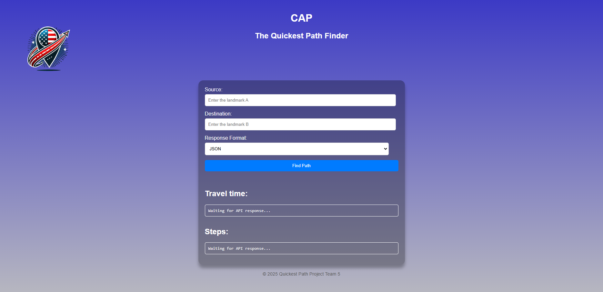

# Functional Specifications - Project Quickest Path

## **Title:** CAP (Cap Api Pathfinder)

**Author:** Robin GOUMY

**Team:**  5

---

| Role | Name |
|---|---|
| Project Manager       | Habi CAILLEAU       |
| Program Manager       | Robin GOUMY         |
| Tech Lead             | Mathias GAGNEPAIN   |
| Software Developer    | Rémy CHARLES        |
| Software Developer    | Maxime Caron        |
| Quality Assurance     | Jason GROSSO        |
| Technical Writer      | Alexandre BOPP      |

---

### *Last Update on January 30th, 2025*

Table of Contents

- [Functional Specifications - Project Quickest Path](#functional-specifications---project-quickest-path)
  - [**Title:** CAP (Cap Api Pathfinder)](#title-cap-cap-api-pathfinder)
    - [*Last Update on January 30th, 2025*](#last-update-on-january-30th-2025)
  - [Introduction](#introduction)
    - [Document Purpose](#document-purpose)
    - [Project Goal](#project-goal)
    - [Project Team Roles](#project-team-roles)
    - [Stakeholders](#stakeholders)
    - [Glossary](#glossary)
- [Requirements](#requirements)
    - [Performance Goals](#performance-goals)
    - [Data Integrity Verification](#data-integrity-verification)
    - [Deliverables](#deliverables)
  - [Context](#context)
    - [Personnas](#personnas)
    - [Use Cases](#use-cases)
  - [Functional Requirements](#functional-requirements)
    - [Description](#description)
    - [Data Checker](#data-checker)
    - [APIs](#apis)
      - [Quickest Path Retrieval](#quickest-path-retrieval)
        - [Query Parameters](#query-parameters)
        - [Headers](#headers)
    - [Example Requests](#example-requests)
      - [Request with Default Format:](#request-with-default-format)
      - [Response Details](#response-details)
    - [Algorithm and Data Processing](#algorithm-and-data-processing)
      - [Heuristic Approach](#heuristic-approach)
      - [Advantages](#advantages)
      - [Disadvantages](#disadvantages)
      - [Input Data](#input-data)
      - [Output](#output)
    - [User Interface](#user-interface)
    - [Acceptance Criteria](#acceptance-criteria)
  - [Non-Functional Requirements](#non-functional-requirements)
    - [Costs](#costs)
    - [User Side](#user-side)
    - [Maintainability](#maintainability)
  - [Risk](#risk)
    - [Competitive Landscape](#competitive-landscape)
    - [Product problem](#product-problem)
    - [Data Security](#data-security)
    - [Risk Management Plan](#risk-management-plan)
  - [Future Improvements](#future-improvements)

---

## Introduction

### Document Purpose

The aim of this document is to describe in detail the functionalities and expected behavior of the software, to ensure a common understanding between all stakeholders (all team members and customers).
  
### Project Goal

The aim of the project is to create a high-performance software solution that calculates the quickest path between two landmarks in the United States.

### Project Team Roles

As defined by the project owner, the team is arranged as follows:

| Role                 | Description                                                                                       |
|----------------------|---------------------------------------------------------------------------------------------------|
| **Project Manager**   | Responsible for organization, planning, and budgeting. Keeps the team motivated.               |
| **Program Manager**   | Ensures the project meets expectations. In charge of design. Writes the Functional Specifications. |
| **Tech Lead**         | Makes technical decisions for the project. Translates Functional Specifications into Technical Specifications. Performs code reviews. |
| **Software Engineer** | Writes code. Creates documentation. Participates in technical design.                       |
| **Quality Assurance** | Tests all functionalities to identify bugs and issues. Documents bugs and issues. Writes the test plan. Verifies fixes are implemented correctly. |
| **Technical Writer**  | Creates and maintains user manuals, technical documentation, and guides. Works with engineers to understand and document features. Ensures documentation is clear, concise, and user-friendly. |

### Stakeholders

| Name           | Occupation                  | Links                          |
|----------------|-----------------------------|--------------------------------|
| Franck JEANNIN | Client (ALGOSUP's director) | [Website](https://algosup.com) |

### Glossary

| Term              | Definition                                                                                                             |
|-------------------|------------------------------------------------------------------------------------------------------------------------|
| **Algorithm**     | A set of clear steps to solve a problem or complete a task, like sorting or searching.                                 |
| **API**           | Application Programming Interface - Rules allowing software to communicate with each other.                            |
| **Approximation** | A method to find a good-enough answer when exact solutions are too hard or slow.                                       |
| **Big O Notation**| Describes how an algorithm's speed changes with input size, like O(n) or O(n²).                                        |
| **C++**           | A powerful programming language used for games, system software, and fast applications.                                |
| **CSV**           | Comma-Separated Values - A simple text format for storing data in tables.                                              |
| **DAG**           | Directed Acyclic Graph - A graph with one-way links and no loops, useful in many systems.                              |
| **Data Checker**| A data checker is a crucial tool for ensuring that the data is correct, reliable and adapted to the algorithm used, thus avoiding errors later on in the program. |  
| **Data Structure**| A way to organize and store data for quick access, like arrays or trees.                                               |
| **Directed Edge** | A one-way connection between two points in a graph.                                                                    |
| **Euclidean Distance** | The straight-line distance between two points in a Euclidean space, calculated using the Pythagorean theorem.     |
| **Frameworks**    | Pre-built tools or libraries to speed up development, like React or Django.                                            |
| **GDPR**          | General Data Protection Regulation - EU law for protecting personal data and privacy.                                  |
| **Graph**         | A collection of points (nodes) connected by lines (edges), like social networks.                                       |
| **Graph Connectivity** | The degree to which nodes in a graph are linked to each other.                                                    |
| **Heuristics**    | Quick methods for solving problems, often based on experience.                                                         |
| **JSON**          | JavaScript Object Notation - A simple format for exchanging data, easier than XML.                                     |
| **Localhost**     | Refers to your own computer acting as a server, usually at 127.0.0.1.                                                  |
| **Machine Learning** | Tech that helps computers learn and improve without being explicitly programmed.                                    |
| **OSRM**          | Open Source Routing Machine - An open-source, high-performance routing engine for calculating routes on road networks. |
| **REST**          | Representational State Transfer - A way to build scalable, reliable web services.                                      |
| **SQL Dataset**   | Data organized in tables, often managed with Structured Query Language (SQL).                                          |
| **STL**           | Standard Template Library - C++ tools for containers and algorithms.                                                   |
| **Test Plan**     | A document describing what, when, and how to test in software.                                                         |
| **UI**            | User Interface - What users see and interact with in software, like buttons and menus.                                 |
| **XML**           | Extensible Markup Language - A flexible format for structuring and exchanging data.                                    |

---

# Requirements

The requirements are the conditions that must be fulfilled to meet the client's expectations.  
These represent the core functionalities we need to implement before the deadline.  
Any additional features developed beyond these requirements will be considered a bonus and add extra value to our work.

| **Category**              | **Details** |
|---------------------------|------------|
| **Programming Language** | The project must be implemented in **C++** to achieve optimal performance. |
| **REST API** | A REST API must be developed to expose the software's functionality via an HTTP server (localhost).    **Endpoint:** A single GET request to calculate the quickest path.    **Input:** Source and destination landmark IDs.    **Output:** Ordered list of landmarks in the path and total travel time.     **Response Formats:** Support both **JSON** and **XML**. |
| **Data Source** | The provided dataset (`USA-roads.csv`) contains ~24 million nodes. This serves as the foundation for computing paths.    - **Format:** Each line represents a connection: `Landmark_A_ID, Landmark_B_ID, Time`.     - Connections are **bidirectional** even if not explicitly listed in the file. |
| **Source Code** | The C++ source code must include **comments** and **clear documentation**. Only **STL libraries** and those required for the web server may be used. |
| **Algorithm Complexity** | Use **Big O notation** to document the time and space complexity of key algorithms. |
| **Test Suite** | A comprehensive test suite is required to validate:     - Correctness of outputs.     - Compliance with the **10% approximation rule**.     - General performance goals. |
| **Data Validation Tool** | A utility must verify the integrity of the dataset before use, ensuring its structure and validity. |

### Performance Goals

| **Category**      | **Details** |
|-------------------|------------|
| **Response Time** | The API must respond to all queries within **1 second** on a typical laptop. |
| **Accuracy** | The algorithm may prioritize **speed over precision** by using heuristics.   **Rule:** The returned path should not exceed the shortest path duration by more than **10%**. |

### Data Integrity Verification

| **Category**      | **Details** |
|-------------------|------------|
| **Graph Validation** | Validate that the dataset forms a **Directed Acyclic Graph (DAG)** and is free of loops. |
| **Connectivity Check** | Ensure the graph is **fully connected**, allowing navigation between any two landmarks. |
| **Programming Language Flexibility** | A language other than C++ may be used for this validation, as performance is not critical in these tasks. |

### Deliverables

For this project all the deadlines for the customer are February 7th 2025. But our Project Manager decided to impose his own deadlines.

| Name | Deadline | Link |
| --  | -- | -- |
| Functional Specifications Document  | 20/01/2025 | [FunctionalSpecifications.md](../functional_specifications/FunctionalSpecifications.md) |
| Technical Specifications Document  | 27/01/2024 | [TechnicalSpecifications.md](../technical_specifications/TechnicalSpecifications.md) |
| Code | 07/01/2025  | [Folder source](../../src) |
| Test Plan | 07/01/2025 | [TestPlan.md](../qa/TestPlan.md) |
| Test Cases | 07/01/2025 | [TestCases.md](../qa/TestCases.md) |
| User Manual | 07/01/2025 | [UserManual.md](../manual/UserManual.md") |

---

## Context

### Personnas

| **Picture** | **Attribute**       | **Details** |
|------------|--------------------|------------|
|  | - **Name**    - **Age**    - **Occupation**    - **Skills**    - **Usage Scenario** | Tom Smith    30 - 40    Logistics Planning Manager    Project management, logistics coordination, team leadership, data analysis    Tom uses the API to calculate real-time optimal delivery routes for his drivers. He tracks distances and travel times to optimize costs and team performance. |

| **Picture** | **Attribute**       | **Details** |
|------------|--------------------|------------|
|  | - **Name**    - **Age**  - **Occupation**  - **Skills**  - **Usage Scenario** | Lucy Martinez    60 - 80   Retiree    Destination research, budgeting, travel planning    Lucy uses an application powered by the API to plan her vacations. She finds the fastest routes, calculates transportation costs, and adjusts her budget accordingly.  |

### Use Cases

The API is designed to be implemented into existing software solutions rather than functioning as a standalone application. It provides seamless integration capabilities to enhance the functionality of third-party platforms.

| **User**             | **Action**                                      | **Expected Result**                       |
|----------------------|-------------------------------------------------|-------------------------------------------|
| Supply Chain Manager | Coordinate deliveries across multiple regions using logistics software | A comprehensive route map segmented by region and time, available within their current logistics tool. |
| Travel Enthusiast    | Plan an efficient multi-stop journey using a travel planning app | A detailed itinerary with travel times and distances for each stop, accessible in their preferred travel app. |

---

## Functional Requirements

### Description

This project involves developing a software solution in C++ to determine the quickest path between two landmarks in the United States, such as Los Angeles and New York.
The goal is to design an algorithm capable of calculating the optimal route efficiently, ensuring results are delivered in under one second.

 

Users simply provide the IDs of two landmarks as input, and the software calculates and returns the quickest path, including travel time and an ordered list of landmarks along the route. Unlike a GPS, this software does not track real-time location but focuses on providing pre-calculated routes between fixed landmarks.

### Data Checker

 

The data checker is essential, for example,  it checks that :

| Check Type          | Description |
|---------------------|-------------|
| Infinite Loops     | Ensures that there are no infinite loops in the data. |
| Duplicate Nodes    | Checks that there are no duplicate nodes. |
| Presence of Nodes  | Verifies that all expected nodes are present. |
| Connectivity      | Ensures that every node has a possible route and is related to others. |
| Data Type Validity | Checks that the data type for each node is usable. |
| Data Completeness | Ensures that each node, stop, and time information is complete. |

 

This algorithm will be implemented in C, as it is a high-performance language at this level, enabling a certain level of precision and efficiency to be achieved.

 

  

 

### APIs

An API is a set of rules and protocols that allows different software applications to communicate and share data with each other.
It defines how requests and responses should be formatted, enabling developers to interact with external services or integrate functionalities without needing to understand their internal workings.

 

 

#### Quickest Path Retrieval

| **Endpoint** | `/quickest-path`                                                                 |
|--------------|----------------------------------------------------------------------------------|
| **Method**   | `GET`                                                                            |
| **Purpose**  | Calculates the quickest path between two specified landmarks in the USA, including step-by-step segments and the total time. |

##### Query Parameters

| Parameter   | Description                                                                         | Required |
|-------------|-------------------------------------------------------------------------------------|----------|
| `source`    | The starting point                                                                  | Yes      |
| `destination` | The finish point                                                                  | Yes      |

##### Headers

| Header     | Description                                                                            |
|------------|----------------------------------------------------------------------------------------|
| `Accept`   | Indicates the desired response format. Defaults to `application/json`.                |

---

### Example Requests

#### Request with Default Format:  

For more information about, read the API documentation [here](../technical_specifications/UserManual.md).

#### Response Details

|Status Code |Description |
|------------|--------------|
|200 |The request was successfully processed, and the response contains the data related to the quickest path calculation between the specified source and destination. |

| **Error**                    | **Status Code**         | **Description**                                                                                                                                         | 
|------------------------------|-------------------------|---------------------------------------------------------------------------------------------------------------------------------------------------------|
| **400 Missing Parameters**    | `400 Bad Request`       | This means required query parameters are missing. For example, a request may not include the "source" or "destination" parameters.                     | 
| **406 Not Acceptable** | `406 Not Acceptable` | This means that the server cannot provide a response in the format requested by the client. This may be due to an unsupported header, e.g. text/html is not supported by the API. |
| **500 Internal Server Error** | `500 Internal Server Error` | This indicates an unexpected error occurred on the server while processing the request. This can be due to system failure, database issues, or other unforeseen errors. |

### Algorithm and Data Processing

#### Heuristic Approach

To ensure fast computations, a heuristic (e.g., Euclidean distance) is used to estimate travel costs between two points.

#### Advantages

- Reduces computation time.
  
- Useful for complex or large spaces.

#### Disadvantages

- May not guarantee an optimal solution.

#### Input Data

Input data is provided in a CSV file containing 24 million nodes with the following structure:

| Point A | Point B | Travel Time |
| --  | -- | -- |
|  6  | 5 | 359 |
|  7  | 8 | 5822 |
|  10  | 9 | 7211 |

>This is an example, the values do not correspond to the actual values.  
  
#### Output

The algorithm returns:

- Total travel time.
  
- An ordered list of landmarks on the optimal path.

### User Interface

Although optional, a simple web interface will be developed using HTML and native CSS to improve user experience.

The aim is to have one main page with all the information. Users will be able to enter their landmarks. 

This will return the begining of steps to reach the destination, as seen on Maps
You can also download the complete file with all directions from landmark A to landmark B in XML or JSON format.

>The web app isn't part of the product, it has been made for debug purposes

### Acceptance Criteria

| **Criterion**           | **Description**                                                    |
|-------------------------|--------------------------------------------------------------------|
| Response time           | The API must respond in less than 1 second for all requests.       |
| Result accuracy         | The calculated path should not exceed a 10% approximation.         |
| Scalability             | The API must continue to function under simultaneous requests.     |

---

## Non-Functional Requirements

### Costs

There is no cost for this project.

### User Side

- Accessible via smartphones, tablets, and desktops.
- Requires an internet connection.

### Maintainability

- Clearly commented and documented code.
- Comprehensive testing and version control.

---

## Risk

### Competitive Landscape

Today's market is highly competitive, with many powerful and advanced companies.

- **Google Maps Platform**: Offers precise, real-time route optimization for various transportation modes. Strong integration with Google services but costly for smaller businesses.  
- **Mapbox**: Known for customization and flexibility, popular with developers. Limited advanced features compared to Google.  
- **OpenStreetMap (OSM)**: A free, community-driven option with customizable tools like OSRM. Less precise in certain areas. OSRM is widely used in mapping, navigation, and logistics applications.

### Product problem

In any project, no issue should ever be taken lightly, as even seemingly minor problems can lead to significant time losses and disrupt progress.
It is essential to approach every detail with attention and care to minimize risks and ensure a smooth workflow. Proactive problem-solving and vigilance are key to avoiding unnecessary setbacks and maintaining the project's momentum.

### Data Security

Compliance with the General Data Protection Regulation (GDPR) is crucial in developing software that interacts with users, ensuring personal data protection and privacy.
By adhering to these standards, developers not only ensure legal compliance but also build user trust.
The GDPR requires transparent data collection, storage, and processing practices, giving users control over their personal information, which is essential for the acceptance of digital technologies.

To kown more about it : [GDPR License](https://en.wikipedia.org/wiki/General_Data_Protection_Regulation)

### Risk Management Plan

| **Risk**                 | **Impact**        | **Probability** | **Mitigation Plan**                                                                    |
|--------------------------|-------------------|-----------------|----------------------------------------------------------------------------------------|  
| Insufficient performance | Project failure   | Medium          | Optimize the data structures used.                                                     |
| Critical bugs            | Delays            | High            | Implement a rigorous test strategy with the team member in charge of Quality Assurance.|
| Organizational issues    | Delays            | Medium          | Hold weekly meetings to monitor progress.                                              |

---

## Future Improvements

- Precision
  - Enhanced routes: More landmarks and live traffic data for better route accuracy.
  - Detailed map info: Road quality, speed zones, and weather conditions.
  
- Efficiency and Optimization
  - Machine learning: Predict and suggest better routes based on travel patterns.
  - Smart rerouting: Automatic updates when traffic worsens.
  - Optimized data: Faster performance with efficient data grouping.
  - Advanced computing: Speeding up complex calculations.

  
We believe these changes will make a real difference in how people use our software, whether they're daily commuters or occasional travelers.