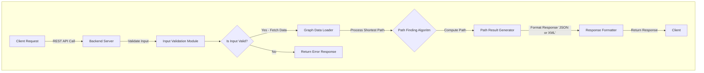
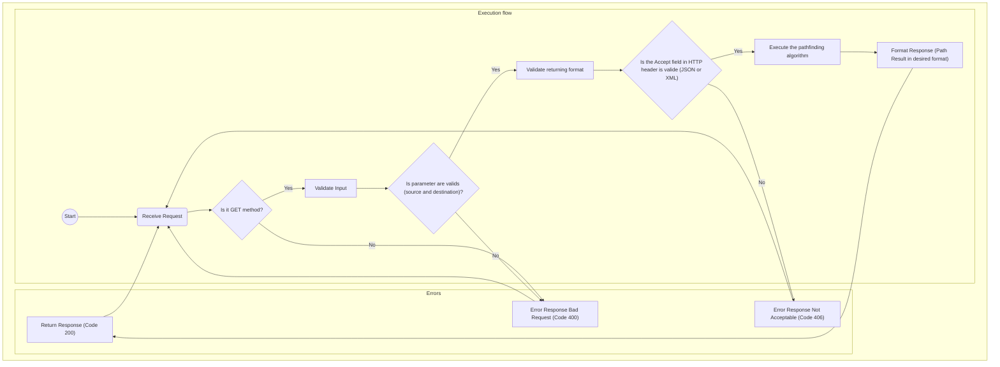
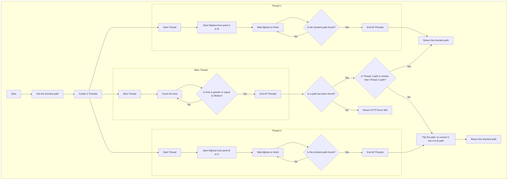
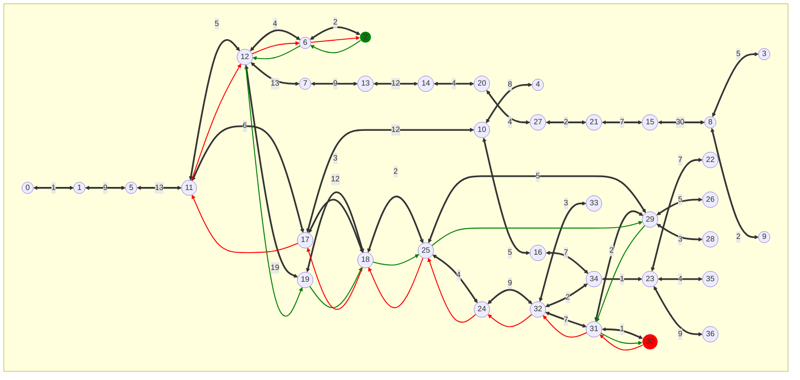
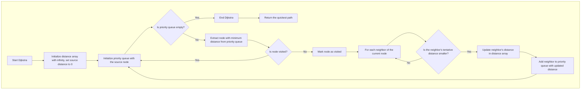
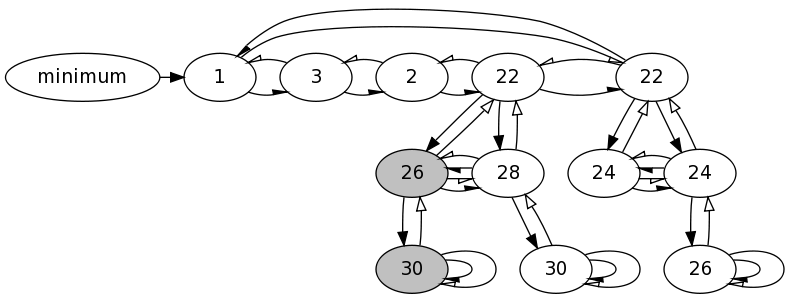
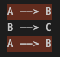

# Technical Specifications

<details>
    <summary>Table of contents</summary>

- [Technical Specifications](#technical-specifications)
  - [Project Overview](#project-overview)
  - [1. Introduction](#1-introduction)
    - [1.1 Purpose](#11-purpose)
    - [1.2 Scope](#12-scope)
    - [1.3 Audience](#13-audience)
    - [1.4 Convention](#14-convention)
      - [1.4.1 File tree and documents](#141-file-tree-and-documents)
      - [1.4.2 Code](#142-code)
        - [Quick Reminder](#quick-reminder)
          - [C Naming](#c-naming)
          - [C++ Naming](#c-naming-1)
  - [2. System Requirements](#2-system-requirements)
    - [2.1 Functional Requirements](#21-functional-requirements)
      - [2.1.1 Data Checker](#211-data-checker)
      - [2.1.2 REST API](#212-rest-api)
    - [2.2 Non-Functional Requirements](#22-non-functional-requirements)
      - [2.2.1 Data Checker](#221-data-checker)
      - [2.2.2 REST API](#222-rest-api)
  - [3. System Architecture](#3-system-architecture)
    - [3.1 Overview](#31-overview)
      - [3.1.1 Key Design Considerations](#311-key-design-considerations)
    - [3.2 Pathfinding Algorithms](#32-pathfinding-algorithms)
      - [3.2.1 Dijkstra's Algorithm](#321-dijkstras-algorithm)
    - [3.3 API Implementation](#33-api-implementation)
      - [3.3.1 Crow](#331-crow)
    - [3.4 Data Flow Overview](#34-data-flow-overview)
      - [3.4.1 High-Level Data Flow Diagram](#341-high-level-data-flow-diagram)
        - [Explanation of the High-Level Data Flow Diagram](#explanation-of-the-high-level-data-flow-diagram)
      - [3.4.2 REST API Execution Flow](#342-rest-api-execution-flow)
        - [Explanation of the REST API Execution Flow](#explanation-of-the-rest-api-execution-flow)
          - [Execution Flow](#execution-flow)
          - [Error Flow](#error-flow)
          - [Loop and Retry](#loop-and-retry)
      - [3.4.2 Shortest Path Algorithm Execution Flow](#342-shortest-path-algorithm-execution-flow)
        - [Explanation of the Shortest Path Algorithm Execution Flow](#explanation-of-the-shortest-path-algorithm-execution-flow)
          - [Thread 1: Calculating Path from Point A to B](#thread-1-calculating-path-from-point-a-to-b)
          - [Main Thread: Measuring Time](#main-thread-measuring-time)
          - [Thread 2: Calculating Path from Point B to A](#thread-2-calculating-path-from-point-b-to-a)
          - [Comparison of Paths](#comparison-of-paths)
          - [Final Outcome](#final-outcome)
        - [Result Visualization](#result-visualization)
      - [3.4.3 Dijkstra's Algorithm Execution Flow](#343-dijkstras-algorithm-execution-flow)
        - [Explanation of the Dijkstra's Algorithm Execution Flow](#explanation-of-the-dijkstras-algorithm-execution-flow)
      - [3.4.4 Fibonacci Heap Node Structure with Pointer Relationships](#344-fibonacci-heap-node-structure-with-pointer-relationships)
        - [Explanation of the Fibonacci Heap Node Structure with Pointer Relationships](#explanation-of-the-fibonacci-heap-node-structure-with-pointer-relationships)
          - [Types of Pointers and Their Representations](#types-of-pointers-and-their-representations)
          - [Arrowhead Styles for Distinguishing Pointer Types](#arrowhead-styles-for-distinguishing-pointer-types)
          - [Synthesis of Child Pointers](#synthesis-of-child-pointers)
          - [Marking and Minimum Identification](#marking-and-minimum-identification)
  - [4. Detailed Design](#4-detailed-design)
    - [4.1 Backend Design](#41-backend-design)
      - [4.1.1. REST API Endpoint](#411-rest-api-endpoint)
      - [4.1.2. Request Handling Layer](#412-request-handling-layer)
      - [4.1.3. Pathfinding Engine](#413-pathfinding-engine)
      - [4.1.4. Data Validation Tool](#414-data-validation-tool)
      - [4.1.5. Security Layer](#415-security-layer)
      - [4.1.6. Response Serialization](#416-response-serialization)
      - [4.1.7. Scalability Design](#417-scalability-design)
      - [4.1.8. Testing and Monitoring](#418-testing-and-monitoring)
    - [4.3 Data Structure](#43-data-structure)
      - [4.3.1 Graph Characteristics](#431-graph-characteristics)
      - [4.3.2 Graph Properties](#432-graph-properties)
      - [4.3.3 Data Representation](#433-data-representation)
      - [4.3.4 Data Integrity Validation](#434-data-integrity-validation)
      - [4.3.5 Usage in Pathfinding](#435-usage-in-pathfinding)
  - [5. Development Approach](#5-development-approach)
    - [5.1 Methodology](#51-methodology)
    - [5.2 Tools and Technologies](#52-tools-and-technologies)
    - [5.3 Libraries used](#53-libraries-used)
    - [5.4 Software](#54-software)
    - [5.5 Target](#55-target)
      - [5.5.1 Desktop Platforms](#551-desktop-platforms)
      - [5.5.2 Web Server for REST API](#552-web-server-for-rest-api)
  - [6. Testing](#6-testing)
    - [6.1 Testing Strategy](#61-testing-strategy)
    - [6.2 Tools](#62-tools)
  - [7. Deployment](#7-deployment)
    - [7.1 Deployment Pipeline](#71-deployment-pipeline)
    - [7.2 Maintenance](#72-maintenance)
  - [8. Security](#8-security)
    - [8.1 Data Security](#81-data-security)
    - [8.2 Compliance](#82-compliance)
    - [8.3 Security Best Practices](#83-security-best-practices)
    - [8.4 Secure Development Practices](#84-secure-development-practices)
  - [9. Glossary](#9-glossary)

</details>

## Project Overview

The application is designed to determine the shortest path from Point A to Point B. It provides users with detailed step-by-step instructions for the journey, including intermediate landmarks and the estimated travel time for each segment[.][3]

## 1. Introduction

<br>

### 1.1 Purpose

The purpose of this document is to define the technical specifications for developing the **pathfinding**<sup>[4](#glossary-4)</sup> application. It offers a detailed overview of the system's requirements, architecture, core functionalities, and the development methodology to be followed[.][3]

### 1.2 Scope

The project encompasses the following key components, each tailored for **cross-platform**<sup>[19](#glossary-19)</sup> compatibility and developed using industry-standard technologies:

1. **Data Checker**
   - `Name:` `DGV (Data Graph Validator)`
   - `Type:` Desktop Application
   - `Technology:` Developed in [C][2]
   - `Supported Platforms:` Linux, Windows, and macOS
2. **REST API**<sup>[2](#glossary-2)</sup>
   - `Name:` `CAP (Cap API Pathfinder)`
   - `Type:` Web API
   - `Technology:` Developed in [C++][1]
   - `Supported Platforms:` **Platform-agnostic**<sup>[3](#glossary-3)</sup>

### 1.3 Audience

This document is intended for the following audiences:

- `Project Managers:` To understand the scope, requirements, and technical details of the project for effective planning and coordination.
- `Software Engineers:` To gain detailed insights into the system architecture, design, and coding standards required for development.
- `UI/UX Designers:` To align their designs with the technical capabilities and limitations outlined in the specifications.
- `Quality Assurance Testers:` To prepare test plans and cases that ensure the application meets the outlined technical requirements.
- `Stakeholders:` To provide an overview of the project's technical aspects, ensuring alignment with business goals and expectations.

### 1.4 Convention

#### 1.4.1 File tree and documents

The naming conventions should be as follows:

| type    | convention   |
| ------- | ------------ |
| Folders | `snake_case` |
| Files   | `PascalCase` |

```md
2024-2025-project-3-quickest-path-team-5
└───documents
    ├───functional
    │   └─── FunctionalSpecifications.md
    ├───quality
    └───technical
        └─── TechnicalSpecifications.md
```

#### 1.4.2 Code

Our coding conventions are aligned with the standard practices and guidelines recommended for each programming language used in this project[.][3] By adhering to language-specific conventions and widely accepted best practices, we ensure code that is consistent, readable, and maintainable[.][3]

For this project, we have established a detailed set of coding conventions tailored to meet our specific requirements and promote collaboration across the team[.][3] These conventions cover aspects such as naming conventions, formatting rules, error handling, and use of language features[.][3]

You can find the full coding convention guidelines in the [Coding Conventions document](CodingConventions.md "Coding Conventions") [.][3]

##### Quick Reminder

###### C Naming

[][2]

<hr>

| Type              | Convention       |
| ----------------- | ---------------- |
| `Variables`       | snake_case       |
| `Constants`       | UPPER_SNAKE_CASE |
| `Functions`       | camelCase        |
| `Structs & Enums` | PascalCase       |

###### C++ Naming

[][1]
<hr>

| Type              | Convention       |
| ----------------- | ---------------- |
| `Variables`       | camelCase        |
| `Constants`       | UPPER_SNAKE_CASE |
| `Functions`       | camelCase        |
| `Class & Structs` | PascalCase       |

## 2. System Requirements

<br>

### 2.1 Functional Requirements  

#### 2.1.1 Data Checker  

- `CSV`<sup>[9](#glossary-9)</sup> `File Import`
  - Users should be able to import a **CSV**<sup>[9](#glossary-9)</sup> file into the application for validation[.][3] Supported formats should be clearly documented, and the system should reject invalid files with detailed feedback[.][3]  

- `Error Reporting`  
  - The application will display detailed error messages in the terminal, including row and column numbers, to help users identify and correct issues in the **CSV**<sup>[9](#glossary-9)</sup> file[.][3]  

- `Visual Representation of Linked Nodes`<sup>[14](#glossary-14)</sup>
  - The application will generate a visual diagram displaying each **node**<sup>[14](#glossary-14)</sup> and its connections, using color-coded indicators for errors or anomalies in the data[.][3]  

- `Node`<sup>[14](#glossary-14)</sup> `and Connection Validation`  
  - The application will verify the integrity of the imported data, ensuring all **nodes**<sup>[14](#glossary-14)</sup> and connections are valid and consistent with the required format[.][3]  

- `Algorithm Complexity`
  - The data validation algorithm used for checks, such as **graph**<sup>[8](#glossary-8)</sup> validation and connectivity, will operate with a **time complexity**<sup>[13](#glossary-13)</sup> of **[O(log n)][6]** for most operations, ensuring efficient processing of large datasets[.][3]

#### 2.1.2 REST API  

- `Endpoint for Shortest Path Calculation`
  - Provide an endpoint that accepts input parameters (e.g., start point, end point) and returns the shortest path, including intermediate steps and estimated travel times[.][3]  

- `Error Handling and Status Codes`
  - Ensure all API endpoints return appropriate **HTTP**<sup>[11](#glossary-11)</sup> status codes and detailed error messages for invalid requests or server errors[.][3]  

### 2.2 Non-Functional Requirements  

#### 2.2.1 Data Checker  

- `Compatibility`
  - The application should be compatible with Linux, Windows, and macOS, supporting the latest releases of each operating system[.][3]  

- `Usability`
  - The interface should provide clear feedback during file imports and error highlighting to minimize user confusion[.][3]  
  - A help section or documentation link should be accessible from the interface for troubleshooting[.][3]  

- `Performance`  
  - The application should process **CSV**<sup>[9](#glossary-9)</sup> files and provide error feedback and graph visual representation using **mermaid**<sup>[10](#glossary-10)</sup>[.][3]  

#### 2.2.2 REST API

- `Performance`
  - The **REST API**<sup>[2](#glossary-2)</sup> should respond to requests within `1 second` under normal conditions and support high throughput[.][3]  

- `Scalability`<sup>[28](#glossary-28)</sup>
  - The backend should be designed to scale horizontally to handle a growing number of concurrent users efficiently[.][3]  

- `Compatibility`  
  - The **REST API**<sup>[2](#glossary-2)</sup> should be **platform-agnostic**<sup>[3](#glossary-3)</sup> and deployable on any server environment that supports the required C++ runtime and dependencies[.][3]  

- `Security`
  - The `deployed version` of the API must adhere to industry-standard practices such as HTTPS for secure communication[.][3]  

- `Documentation`
  - Comprehensive **API documentation**<sup>[23](#glossary-23)</sup> must be provided, including endpoint details, example requests/responses, and error codes[.][3]

> [!NOTE]
> The API Documentation can be found [HERE](APIDocumentation.md).
  
## 3. System Architecture

<br>

### 3.1 Overview  

The system architecture is designed to ensure seamless functionality, high performance, and a user-friendly experience across all supported platforms[.][3] It consists of the following key components:

- `Desktop Application (Data Checker)`
  - `Technology`: Developed using [C][2] for its performance in handling **data integrity**<sup>[33](#glossary-33)</sup> checks[.][3]  
  - `Purpose`: A utility application used to validate the integrity of the dataset (e.g., **CSV**<sup>[9](#glossary-9)</sup> file) by verifying **graph**<sup>[8](#glossary-8)</sup> properties such as connectivity and absence of loops[.][3]  
  - `Supported Platforms`: Compatible with Linux, Windows, and macOS[.][3]  

- `REST API<sup>[2](#glossary-2)</sup>`
  - `Technology`: Developed using [C++][1] to ensure **platform-agnostic**<sup>[3](#glossary-3)</sup> deployment[.][3]  
  - `Purpose`: Exposes core functionality through an **HTTP**<sup>[11](#glossary-11)</sup> server, providing endpoints for calculating shortest paths, managing data, and retrieving results in multiple formats (e.g., **JSON**<sup>[16](#glossary-16)</sup> or **XML**<sup>[17](#glossary-17)</sup>)[.][3]  
  - `Compatibility`: Designed to be deployable on any server environment that supports the required C++ runtime[.][3]  

#### 3.1.1 Key Design Considerations

- `Modular Design`<sup>[27](#glossary-27)</sup>: Each component is designed to operate independently, ensuring maintainability and ease of updates[.][3]  
- `High Performance`: The architecture prioritizes efficiency to handle large datasets and complex computations within the defined performance constraints[.][3]  
- `Cross-Platform`<sup>[19](#glossary-19)</sup> `Support`: Desktop applications and the **REST API**<sup>[2](#glossary-2)</sup> are built to function seamlessly across Linux, Windows, and macOS[.][3]  
- `Extensibility`: The system is designed to accommodate future enhancements, such as adding new endpoints, improving UI/UX, or integrating with external services[.][3]  

### 3.2 Pathfinding Algorithms

To complete this project, we employ a robust algorithms, **Dijkstra's Algorithm**<sup>[5](#glossary-5)</sup>, to balance fast runtime and accuracy in **pathfinding**<sup>[4](#glossary-4)</sup>[.][3]  

#### 3.2.1 Dijkstra's Algorithm

- `Purpose:`  
  Finds the shortest path between two landmarks in a **graph**<sup>[8](#glossary-8)</sup>[.][3]  
- `Advantages:`  
  - Guarantees the shortest path[.][3]  
  - Works well when all **edge**<sup>[15](#glossary-15)</sup> weights are non-negative[.][3]  
- `Usage in the Project:`  
  **Dijkstra's algorithm**<sup>[5](#glossary-5)</sup> is used for cases where simplicity and guaranteed accuracy are prioritized over speed[.][3]  

### 3.3 API Implementation

#### 3.3.1 Crow

- `Purpose:`  
  Crow is a C++ microframework used to quickly build REST APIs. It is designed for high performance, easy setup, and a minimalistic approach to handling HTTP requests. With its simple API, Crow allows developers to define routes, handle HTTP methods (**GET**<sup>[37](#glossary-37)</sup>, POST, PUT, DELETE), and serve content efficiently. It can be seen as a lightweight alternative to larger web frameworks in C++.

- `Advantages:`
  1. `High Performance:` Crow is built on C++ which gives it an edge in performance over other frameworks, especially for systems that require low latency and high throughput.
  2. `Lightweight and Simple:` The framework has minimal dependencies, making it easy to integrate and use without much overhead. Its intuitive syntax allows quick development and deployment.
  3. `Asynchronous Request Handling:` Crow supports asynchronous I/O operations, improving scalability and responsiveness for APIs under heavy traffic.
  4. `HTTP/1 and WebSocket Support:` In addition to supporting basic HTTP requests, Crow also includes WebSocket support for real-time communication, making it versatile for various web applications.
  5. `JSON and XML Support:` Native support for handling JSON and XML data makes it easier to build RESTful services with Crow.

- `Usage in the Project:`  
  In the context of this project, Crow is used to implement the REST API that communicates between the front-end and back-end systems. The API will be responsible for:
  1. `Serving Graph Data:` It handles requests to retrieve graph-related data (nodes, edges, distances) and delivers it in JSON format for use by the front-end visualization tools.
  2. `Processing Pathfinding Algorithms:` Crow serves endpoints that allow for submitting graph data to the back-end for computation, then returning results such as the shortest path.
  3. `Request/Response Handling:` For every user interaction, Crow processes the incoming HTTP requests, handles any necessary computations, and returns the response in the expected format.

### 3.4 Data Flow Overview

Below is a high-level representation of the data flow in the system using a **Mermaid**<sup>[10](#glossary-10)</sup> diagram:  

#### 3.4.1 High-Level Data Flow Diagram



##### Explanation of the High-Level Data Flow Diagram

1. `Client Request:`  
   - The process begins when a client sends a **REST API**<sup>[2](#glossary-2)</sup> request to the `Backend Server`. The request contains the source and destination landmarks (**nodes**<sup>[14](#glossary-14)</sup>) for which the shortest path is required[.][3]
2. `Input Validation Module:`  
   - The `Backend Server` forwards the request to the `Input Validation Module`, which checks the validity of the input (e.g., valid IDs, non-empty input\)[.][3] This involves verifying that the provided source and destination **nodes**<sup>[14](#glossary-14)</sup> exist and that the parameters are correctly formatted[.][3] If the input is valid, the system proceeds; otherwise, an error response is returned to the client[.][3]
3. `Graph Data Loader:`  
   - If the input is valid, the `Graph Data Loader` retrieves the relevant **graph<sup>[8](#glossary-8)</sup> data** (**nodes**<sup>[14](#glossary-14)</sup> and **edges**<sup>[15](#glossary-15)</sup>) from the dataset and loads it into memory[.][3] This data will be used in the next steps to compute the shortest path[.][3]
4. `Dijkstra's Algorithm Execution:`  
   - The **Dijkstra's algorithm**<sup>[5](#glossary-5)</sup> calculates the minimal path by evaluating the **edges**<sup>[15](#glossary-15)</sup> and **nodes**<sup>[14](#glossary-14)</sup> of the graph based on their weights (distances or costs\)[.][3]
5. `Path Result Generator:`  
   - Once the algorithm completes, the `Path Result Generator` processes the results[.][3] It converts the raw output (a list of **nodes**<sup>[14](#glossary-14)</sup> in the shortest path, including distances) into a structured format that can be easily understood by the client[.][3]
6. `Response Formatter:`  
   - The `Response Formatter` takes the processed data and formats it according to the client's request (either **JSON**<sup>[16](#glossary-16)</sup> or **XML**<sup>[17](#glossary-17)</sup>)[.][3] This ensures that the output is compatible with the client's expected format[.][3]
7. `Client Response:`  
   - Finally, the `Backend Server` sends the formatted response back to the client, which contains the shortest path from the source to the destination, including details like travel times or distances between intermediate **nodes**<sup>[14](#glossary-14)</sup>[.][3]
8. `Error Handling:`  
   - If at any point the input validation fails, the system will return an error response (using appropriate **HTTP**<sup>[11](#glossary-11)</sup> status codes), which will be received by the client[.][3]

#### 3.4.2 REST API Execution Flow

The following explains the flow of the **REST API**<sup>[2](#glossary-2)</sup> execution for processing a pathfinding request in a typical system[.][3] The flow is designed to validate inputs, process the pathfinding algorithm, and return a response in the requested format[.][3]



##### Explanation of the REST API Execution Flow

###### Execution Flow

1. `Start`  
   The process begins, triggering the API endpoint that handles the pathfinding request[.][3]

2. `Receive Request`  
   The API receives the incoming request[.][3] This could be from a web client, application, or service requesting a pathfinding result[.][3]

3. `Is it GET method?`  
   The first check is to determine if the request is a **GET**<sup>[37](#glossary-37)</sup> request[.][3] This is crucial because the API only support the **GET**<sup>[37](#glossary-37)</sup> method for retrieving pathfinding results[.][3]

   - `Yes`: If the request is a **GET**<sup>[37](#glossary-37)</sup> method, the flow proceeds to the next step[.][3]
   - `No`: If the request is not a **GET**<sup>[37](#glossary-37)</sup> method, the system will return a **400 Bad Request**<sup>[44](#glossary-44)</sup> response (invalid method)<span></span>[.][3]

4. `Validate Input`  
   The API validates the incoming parameters from the request[.][3] These parameters typically include the `source` and `destination` nodes for the pathfinding operation[.][3]

5. `Are parameters valid (source and destination)?`  
   The next validation step checks whether the `source` and `destination` nodes are valid and exist in the system[.][3] This ensures that the input data is correct and prevents errors during pathfinding[.][3]

   - `Yes`: If the parameters are valid, the flow continues to the next step[.][3]
   - `No`: If any of the parameters are invalid (e.g., the nodes do not exist), the system returns a **400 Bad Request**<sup>[44](#glossary-44)</sup> response indicating the issue with the parameters[.][3]

6. `Validate returning format`  
   The API checks the **Accept field**<sup>[38](#glossary-38)</sup> in the **HTTP**<sup>[11](#glossary-11)</sup> header to ensure the desired response format (e.g., **JSON**<sup>[16](#glossary-16)</sup> or **XML**<sup>[17](#glossary-17)</sup>) is supported[.][3] This step ensures that the API responds in the correct format, based on client preferences[.][3]

7. `Is the Accept field in HTTP`<sup>[11](#glossary-11) </sup>`header valid (JSON`<sup>[16](#glossary-16)</sup> `or XML`<sup>[17](#glossary-17)</sup>`)?`  
   The system checks if the **Accept**<sup>[38](#glossary-38)</sup> header contains a valid format such as `application/json` or `application/xml`[.][3]

   - `Yes`: If the **Accept**<sup>[38](#glossary-38)</sup> header is valid, the system proceeds with the pathfinding execution[.][3]
   - `No`: If the **Accept**<sup>[38](#glossary-38)</sup> header is invalid or unsupported, the system responds with a **406 Not Acceptable**<sup>[45](#glossary-45)</sup> error[.][3]

8. `Execute the pathfinding algorithm`  
   The API executes the core pathfinding algorithm based on the `source` and `destination` parameters[.][3] This step involves processing the graph, performing computations to determine the shortest path or optimal route[.][3]

9. `Format Response (Path Result in desired format)`  
   After the pathfinding algorithm executes, the results are formatted into the requested format (**JSON**<sup>[16](#glossary-16)</sup> or **XML**<sup>[17](#glossary-17)</sup>)<span></span>[.][3] The response is structured to provide the path data in a clear and consumable way for the client[.][3]

10. `Return Response (Code 200`<sup>[46](#glossary-46)</sup>`)`  
   The system sends the **200 OK**<sup>[46](#glossary-46)</sup> response with the formatted pathfinding result[.][3] The response includes the desired data (such as the path, distance, or any other relevant details) and confirms that the request was successfully processed[.][3]

###### Error Flow

In case of any issues during the request validation or processing, the system may respond with error codes:

1. `Error Response - Bad Request (Code 400`<sup>[44](#glossary-44)</sup>`)`  
   If the request method is incorrect, or the parameters (`source` or `destination`) are invalid, the system responds with a **400 Bad Request**<sup>[44](#glossary-44)</sup> status code indicating that the request could not be processed due to invalid input[.][3]

2. `Error Response - Not Acceptable (Code 406`<sup>[45](#glossary-45)</sup>`)`  
   If the **Accept**<sup>[38](#glossary-38)</sup> header specifies a format that the system does not support (neither **JSON**<sup>[16](#glossary-16)</sup> nor **XML**<sup>[17](#glossary-17)</sup>), the system returns a **406 Not Acceptable**<sup>[45](#glossary-45)</sup> response indicating that the requested format is not supported[.][3]

###### Loop and Retry

- Once an error occurs (either **400**<sup>[44](#glossary-44)</sup> or **406**<sup>[45](#glossary-45)</sup>), the system resets the process, awaiting a new request, which can be retried with corrected parameters or headers[.][3]

#### 3.4.2 Shortest Path Algorithm Execution Flow



##### Explanation of the Shortest Path Algorithm Execution Flow

This flowchart illustrates the execution of a shortest path algorithm using a **multithreading**<sup>[42](#glossary-42)</sup> approach, where three **threads**<sup>[42](#glossary-42)</sup> are employed to perform different tasks concurrently[.][3] The primary goal is to find the shortest path between two points, A and B, while also measuring the time taken and comparing the results[.][3]

---

1. `Start:`
   - The process begins when the user requests to find the shortest path between two points, A and B[.][3]

2. `Get the Shortest Path:`
   - The system initiates the calculation for the shortest path and starts the process in parallel **threads**<sup>[42](#glossary-42)</sup>[.][3]

3. `Create 3 Threads:`
   - Three **threads**<sup>[42](#glossary-42)</sup> are created to perform different tasks concurrently:
     1. `Thread 1`: Calculates the shortest path from point A to B using **Dijkstra's algorithm**<sup>[5](#glossary-5)</sup>[.][3]
     2. `Thread 2`: Calculates the shortest path from point B to A using **Dijkstra's algorithm**<sup>[5](#glossary-5)</sup>[.][3]
     3. `Main Thread`: Tracks the time taken and determines whether the process completes within a specified time[.][3]

---

###### Thread 1: Calculating Path from Point A to B

1. `Start Thread`<sup>[42](#glossary-42)</sup> `1:`
   - The first **thread**<sup>[42](#glossary-42)</sup> starts executing[.][3]
2. `Start Dijkstra`<sup>[5](#glossary-5)</sup> `from Point A to B:`
   - **Thread**<sup>[42](#glossary-42)</sup> 1 runs **Dijkstra's algorithm**<sup>[5](#glossary-5)</sup> starting from point A to point B to find the shortest path[.][3]
3. `Wait for Dijkstra`<sup>[5](#glossary-5)</sup> `to Finish:`
   - The **thread**<sup>[42](#glossary-42)</sup> waits for the algorithm to finish computing the shortest path[.][3]
4. `Is the Shortest Path Found?`
   - If **Dijkstra's algorithm**<sup>[5](#glossary-5)</sup> finds a valid path, the **thread**<sup>[42](#glossary-42)</sup> ends; otherwise, it continues executing until a valid path is found[.][3]
5. `End All Threads`<sup>[42](#glossary-42)</sup>`:`
   - Once the path is found, **Thread**<sup>[42](#glossary-42)</sup> 1 completes, signaling the end of its task[.][3]
6. `Return the Shortest Path:`
   - The shortest path from point A to point B is returned by the **thread**<sup>[42](#glossary-42)</sup>[.][3]

---

###### Main Thread: Measuring Time

1. `Start Main Thread`<sup>[42](#glossary-42)</sup>`:`
    - The main **thread**<sup>[42](#glossary-42)</sup> begins execution and starts the time tracking process[.][3]

2. `Count the Time:`
    - The system starts counting the time taken for the pathfinding calculations[.][3]

3. `Is Time Greater Than or Equal to 950ms?`
    - The main **thread**<sup>[42](#glossary-42)</sup> monitors the time[.][3] If the time taken by the **threads**<sup>[42](#glossary-42)</sup> exceeds 950ms, the process is stopped and the **threads**<sup>[42](#glossary-42)</sup> are ended[.][3]

4. `End All Threads`<sup>[42](#glossary-42)</sup>`:`
    - If the time limit is reached, the main **thread**<sup>[42](#glossary-42)</sup> ends all active **threads**<sup>[42](#glossary-42)</sup>[.][3]

---

###### Thread 2: Calculating Path from Point B to A

1. `Start Thread`<sup>[42](#glossary-42)</sup> `2:`
    - The second **thread**<sup>[42](#glossary-42)</sup> starts executing concurrently with the others[.][3]

2. `Start Dijkstra`<sup>[5](#glossary-5)</sup> `from Point B to A:`
    - **Thread**<sup>[42](#glossary-42)</sup> 2 runs **Dijkstra's algorithm**<sup>[5](#glossary-5)</sup> in reverse, from point B to point A[.][3]

3. `Wait for Dijkstra`<sup>[5](#glossary-5)</sup> `to Finish:`
    - **Thread**<sup>[42](#glossary-42)</sup> 2 waits for the **Dijkstra algorithm**<sup>[5](#glossary-5)</sup> to finish[.][3]

4. `Is the Shortest Path Found?`
    - **Thread**<sup>[42](#glossary-42)</sup> 2 checks whether it has found a valid path[.][3] If yes, it proceeds to the next step; otherwise, it waits until a valid path is found[.][3]

5. `End All Threads`<sup>[42](#glossary-42)</sup>`:`
    - Once the shortest path is found, the second **thread**<sup>[42](#glossary-42)</sup> completes its task[.][3]

6. `Flip the Path`
    - Since the user want each steps from A(starting point) to B(destination), the path is "flipped" to convert it from `B --> A` to `A --> B`[.][3]

7. `Return the Shortest Path:`
    - The shortest path from point A to point B is returned by **Thread**<sup>[42](#glossary-42)</sup> 2[.][3]

---

###### Comparison of Paths

1. `Compare Path Lengths:`
    - After both **threads**<sup>[42](#glossary-42)</sup> (**Thread**<sup>[42](#glossary-42)</sup> 1 and **Thread**<sup>[42](#glossary-42)</sup> 2) have stopped, the system compares the paths found by the two **threads**<sup>[42](#glossary-42)</sup>[.][3]

2. `Is Thread`<sup>[42](#glossary-42)</sup> `1 Path Shorter Than Thread`<sup>[42](#glossary-42)</sup> `2 Path?`
    - If the path calculated by **Thread**<sup>[42](#glossary-42)</sup> 1 (A to B) is shorter than the path calculated by **Thread**<sup>[42](#glossary-42)</sup> 2 (B to A), the result from **Thread**<sup>[42](#glossary-42)</sup> 1 is selected[.][3]

3. `Return the Shortest Path:`
    - If **Thread**<sup>[42](#glossary-42)</sup> 1's path is shorter, it returns the path from A to B; otherwise, it returns **Thread**<sup>[42](#glossary-42)</sup> 2's the path from B to A[.][3]

---

###### Final Outcome

- The system determines the shortest path by comparing the results of both **threads**<sup>[42](#glossary-42)</sup> and considers the time taken to ensure efficiency[.][3]
- The shortest path is returned to the user, either from `A to B` or `B to A`, depending on the results of the comparison[.][3]

##### Result Visualization

The following **Mermaid**<sup>[10](#glossary-10)</sup> diagram illustrates the **graph**<sup>[8](#glossary-8)</sup> structure and the paths calculated by each **thread**<sup>[42](#glossary-42)</sup>:
  
- `Thread 1 Path`: Calculated from `A` *(node 2)* `to B` *(node 30)*(green arrows)
- `Thread 2 Path`: Calculated from `B` *(node 30)* `to A` *(node 2)*(red arrows)



> [!IMPORTANT]
>
> - `2(green node)` is considered in this exemple as the `starting point(A)`
> - `30(red node)` is considered in this exemple as the `destination(B)`
>
> In this exemple, we assume the algorithm took less than 950ms to find the shortest path from `A` to `B` but if it was the case we can clearly understand why it's important to compare both shortest path found at the stopping of the thread:
>
> - `Thread 1` path as a weight(total length) of `38`
> - `Thread 2` path as a weight(total length) of `52`
>
> By comparing both paths, we can clearly see and return the shortest path calculated overall.

#### 3.4.3 Dijkstra's Algorithm Execution Flow



##### Explanation of the Dijkstra's Algorithm Execution Flow

The following diagram illustrates the step-by-step execution of **Dijkstra's algorithm**<sup>[5](#glossary-5)</sup> for finding the shortest path between two **nodes**<sup>[14](#glossary-14)</sup> in a graph[.][3] Below is a detailed breakdown of each step in the process:

---

1. `Start`  
   The algorithm begins[.][3] This marks the initiation of the process to find the shortest path between the source **node**<sup>[14](#glossary-14)</sup> and the destination **node**<sup>[14](#glossary-14)</sup>[.][3]

2. `Initialize Distance Array with Infinity, Set Source Distance to 0`  
   - The algorithm initializes an array of distances, setting the distance for all **nodes**<sup>[14](#glossary-14)</sup> to `infinity (∞)` because their exact distances are unknown initially[.][3]
   - The distance for the **source node**<sup>[14](#glossary-14)</sup> is set to 0 since the shortest path from the source to itself is always zero[.][3]

3. `Initialize Priority Queue`<sup>[30](#glossary-30)</sup> `with the Source Node`<sup>[14](#glossary-14)</sup>
   - The algorithm initializes a **priority queue**<sup>[30](#glossary-30)</sup> (often implemented as a min-heap) and inserts the **source node**<sup>[14](#glossary-14)</sup> with a distance of 0[.][3]
   - The **priority queue**<sup>[30](#glossary-30)</sup> ensures that the **node**<sup>[14](#glossary-14)</sup> with the smallest tentative distance is always processed first[.][3]

4. `Is Priority Queue`<sup>[30](#glossary-30)</sup> `Empty?`  
   - The algorithm checks if the **priority queue**<sup>[30](#glossary-30)</sup> is empty[.][3]
     - `Yes`: If the queue is empty, it means all reachable **nodes**<sup>[14](#glossary-14)</sup> have been processed[.][3] The algorithm terminates here, and the shortest path is found[.][3]
     - `No`: If the queue is not empty, the algorithm proceeds to process the next **node**<sup>[14](#glossary-14)</sup>[.][3]

5. `Extract Node with Minimum Distance from Priority Queue`<sup>[30](#glossary-30)</sup>  
   - The algorithm extracts the **node**<sup>[14](#glossary-14)</sup> with the smallest distance from the **priority queue**<sup>[30](#glossary-30)</sup>[.][3]
   - This **node**<sup>[14](#glossary-14)</sup> is then marked as the current **node**<sup>[14](#glossary-14)</sup> being processed[.][3]

6. `Is Node Visited?`  
   - The algorithm checks if the current **node**<sup>[14](#glossary-14)</sup> has already been visited[.][3]
     - `Yes`: If the **node**<sup>[14](#glossary-14)</sup> has been visited before, the algorithm skips processing it again and moves to the next **node**<sup>[14](#glossary-14)</sup> in the priority queue[.][3]
     - `No`: If the **node**<sup>[14](#glossary-14)</sup> has not been visited, the algorithm proceeds to process the **node**<sup>[14](#glossary-14)</sup>[.][3]

7. `Mark Node`<sup>[14](#glossary-14)</sup> `as Visited`  
   - The **node**<sup>[14](#glossary-14)</sup> is marked as `visited` to avoid reprocessing it in future iterations[.][3]

8. `For Each Neighbor of the Current Node`<sup>[14](#glossary-14)</sup>  
   - The algorithm iterates over all neighbors of the current **node**<sup>[14](#glossary-14)</sup> to explore the shortest paths through them[.][3]

9. `Is the Neighbor's Tentative Distance Smaller?`  
   - For each neighbor, the algorithm checks if its `tentative distance` (current known distance) is smaller than the previously recorded distance[.][3]
     - `Yes`: If the tentative distance is smaller, the algorithm updates the neighbor's distance in the distance array[.][3]
     - `No`: If the neighbor's tentative distance is not smaller, no update is made, and the algorithm moves to the next neighbor[.][3]

10. `Update Neighbor's Distance in Distance Array`  
    - If the tentative distance for a neighbor is smaller than the recorded distance, the algorithm updates that neighbor's distance in the distance array[.][3]

11. `Add Neighbor to Priority Queue`<sup>[30](#glossary-30)</sup> `with Updated Distance`  
    - The updated neighbor is then added to the **priority queue**<sup>[30](#glossary-30)</sup> with its new, smaller tentative distance[.][3]

12. `Is Priority Queue Empty Again?`  
    - The algorithm checks the priority queue again to determine if there are any more nodes to process[.][3]
    - If the queue is not empty, it continues processing the remaining nodes until all reachable nodes are processed[.][3]

13. `Return the Quickest Path`  
    - Once all **nodes**<sup>[14](#glossary-14)</sup> have been processed and the **priority queue**<sup>[30](#glossary-30)</sup> is empty, the algorithm concludes, and the `shortest path` from the source **node**<sup>[14](#glossary-14)</sup> to the destination **node**<sup>[14](#glossary-14)</sup> is returned[.][3]

#### 3.4.4 Fibonacci Heap Node Structure with Pointer Relationships



##### Explanation of the Fibonacci Heap Node Structure with Pointer Relationships

###### Types of Pointers and Their Representations

1. `Next and Previous Pointers:`
   - Represented by `half-headed arrows`.
   - These pointers are used to navigate between sibling nodes in a circular doubly linked list.
   - Each node in the heap maintains links to its next and previous sibling nodes for efficient traversal.

2. `Child and Parent Pointers:`
   - Represented by `half-headed full arrows`.
   - Child pointers point to the first child of a node, while parent pointers point back to the node's parent.
   - These relationships help maintain the hierarchical structure of the heap.

---

###### Arrowhead Styles for Distinguishing Pointer Types

- `Filled Arrowheads:`
  - Denote `next` and `child` pointers.
  - For example, a filled arrow pointing to a node signifies a connection to either the next sibling or the first child.

- `White Arrowheads:`
  - Denote `previous` and `parent` pointers.
  - These help indicate backward relationships in both sibling and parent-child relationships.

---

###### Synthesis of Child Pointers

- `Representation of Child Relationships:`
  - In diagrams, child pointers are often "synthesized," meaning all children of a node may appear to have direct connections to the parent.
  - In reality, only `one child pointer` is stored per node. This pointer leads to the first child, from which siblings can be navigated using the next and previous pointers.

- `Sibling Navigation:`
  - Since sibling nodes are part of a circular doubly linked list, additional child pointers are unnecessary. Siblings can be found through the next and previous pointers.

---

###### Marking and Minimum Identification

- `Marked Nodes:`
  - Marked nodes, which are nodes that have lost a child since their last connection to a parent, are represented as `grey`.
  - These nodes indicate that a cascading cut may be necessary if they lose another child.

- `Minimum Node:`
  - The minimum node is the root node with the smallest key.
  - It is typically highlighted in diagrams to differentiate it from other nodes.

## 4. Detailed Design

<br>

### 4.1 Backend Design

The backend is structured to handle multiple requests efficiently and securely[.][3] Key components include:

#### 4.1.1. REST API Endpoint

- `Purpose`: Provides access to the core functionality of the application through a single **GET**<sup>[37](#glossary-37)</sup> endpoint[.][3]  
- `Input`: Accepts source and destination landmark IDs as query parameters[.][3]  
- `Output`: Returns the travel time and the ordered list of landmarks in the shortest path in **XML**<sup>[17](#glossary-17)</sup> or **JSON**<sup>[16](#glossary-16)</sup> formats[.][3]  
- `Design`: Built using C++ for high performance, leveraging lightweight **HTTP**<sup>[11](#glossary-11)</sup> server library called `crow`[.][3]

#### 4.1.2. Request Handling Layer

- `Purpose`: Parses incoming requests, validates inputs, and routes them to the appropriate modules[.][3]  
- `Error Handling`: Ensures that invalid or incomplete requests return descriptive error messages (e.g., **400 Bad Request**<sup>[44](#glossary-44)</sup>)<span></span>[.][3]  
- `Concurrency`<sup>[32](#glossary-32)</sup>`:` Supports handling multiple requests simultaneously using **threading**<sup>[42](#glossary-42)</sup> or asynchronous techniques[.][3]

#### 4.1.3. Pathfinding Engine

- `Purpose`: Implements the core algorithm for finding the shortest path between two landmarks[.][3]  
- `Algorithm`: Utilizes **Dijkstra**<sup>[5](#glossary-5)</sup>’s  algorithm for optimal precision using **DFS**<sup>[6](#glossary-6)</sup> and **Fibonacci Heap**<sup>[22](#glossary-22)</sup> (**priority queue**<sup>[30](#glossary-30)</sup>) for optimal performance[.][3]  
- `Data Loading`: Reads the **graph**<sup>[8](#glossary-8)</sup> data (from `USA-roads.csv`) into memory during initialization to optimize query response times[.][3]  
- `Performance Goals`: Ensures responses within 1 second for typical requests[.][3]

#### 4.1.4. Data Validation Tool

- `Purpose`: Verifies the integrity of the **graph**<sup>[8](#glossary-8)</sup> data before it is loaded into the server's memory[.][3]  
- `Functionality`: Ensures that the dataset forms a fully connected **graph**<sup>[8](#glossary-8)</sup> and is free of loops[.][3]  
- `Implementation`: Operates independently from the API, but highly recommanded before uploading a **CSV**<sup>[9](#glossary-9)</sup> on the server[.][3]

#### 4.1.5. Security Layer

- `Purpose`: Protects the **REST API**<sup>[2](#glossary-2)</sup> from unauthorized access[.][3]  
- `Implementation`:
  - **Input sanitization**<sup>[41](#glossary-41)</sup> to prevent injection attacks[.][3]  
  - **Rate limiting**<sup>[35](#glossary-35)</sup> to mitigate **DoS (Denial of Service**<sup>[52](#glossary-52)</sup>**)** attacks[.][3]

#### 4.1.6. Response Serialization

- `Purpose`: Converts the output of the **pathfinding**<sup>[4](#glossary-4)</sup> engine into the requested format (**XML**<sup>[17](#glossary-17)</sup> or **JSON**<sup>[16](#glossary-16)</sup>)[.][3]  
- `Design`: Utilizes **lightweight serialization**<sup>[39](#glossary-39)</sup> implementation to minimize overhead while maintaining compatibility with modern REST standards[.][3]

#### 4.1.7. Scalability Design

- `Purpose`: Prepares the backend for increasing traffic and data loads[.][3]  
- `Techniques`:  
  - **Modular architecture**<sup>[43](#glossary-43)</sup> to allow easy scaling of individual components[.][3]  
  - Potential integration with a **load balancer**<sup>[40](#glossary-40)</sup> for distributed deployments in production environments[.][3]

#### 4.1.8. Testing and Monitoring

- `Unit Testing`<sup>[47](#glossary-47)</sup>: Comprehensive test suite to validate the correctness of each backend component[.][3]  
- `Performance Testing`: Ensures the API meets the 1-second response time requirement under normal conditions[.][3]  
- `Logging and Monitoring`: Captures API usage and performance metrics to diagnose issues and optimize performance over time[.][3]

### 4.3 Data Structure

The application relies on a **weighted, undirected graph<sup>[8](#glossary-8)</sup>** to model the road network of landmarks and travel times[.][3] This graph structure serves as the foundation for implementing efficient **pathfinding**<sup>[4](#glossary-4)</sup> algorithms and ensuring accurate results within the defined performance constraints[.][3]

#### 4.3.1 Graph Characteristics

- `Nodes`<sup>[14](#glossary-14)</sup> `(Vertices`<sup>[18](#glossary-18)</sup>`):`  
  Represent landmarks in the road network[.][3] Each **node**<sup>[14](#glossary-14)</sup> is uniquely identified by a landmark ID[.][3]

- `Edges`<sup>[15](#glossary-15)</sup>`:`  
  Represent bidirectional roads connecting two landmarks[.][3] Each **edge**<sup>[15](#glossary-15)</sup> has a weight, which corresponds to the travel time between the two connected landmarks[.][3]

- `Weights:`
  **Edge**<sup>[15](#glossary-15)</sup> weights are integer values representing travel time in an unspecified unit[.][3] Lower weights indicate shorter travel times[.][3]

#### 4.3.2 Graph Properties

- `Weighted:`
  Each **edge**<sup>[15](#glossary-15)</sup> has a numerical value (weight) representing travel time[.][3]

- `Undirected:`  
  Roads are bidirectional[.][3] If an **edge**<sup>[15](#glossary-15)</sup> exists from landmark A to landmark B, the reverse is also true[.][3]

- `Cyclic:`  
  The **graph**<sup>[8](#glossary-8)</sup> inherently contains cycles, as multiple paths often connect landmarks[.][3]

- `Sparse Graph:`  
  Since real-world road networks are typically sparse (many fewer **edges**<sup>[15](#glossary-15)</sup> than the maximum possible), efficient data structures are used to optimize memory and runtime performance[.][3]

#### 4.3.3 Data Representation

The **graph**<sup>[8](#glossary-8)</sup> will be implemented using the following data structures for optimal performance and **scalability**<sup>[28](#glossary-28)</sup>:

1. Linked List of Linked Lists:

     - A linked list of linked lists is a data structure where each node in the main linked list contains a reference to another linked list. This structure is often used to represent hierarchical or multi-dimensional data, such as graphs, matrices, or sparse arrays.
     - It is particularly useful when the data is irregular or sparse, as it avoids allocating memory for unused elements.

   `Example:`

   ```text
    Main List: [Node A] -> [Node B] -> [Node C]  
    Node A: [Data 1] -> [Data 2]  
    Node B: [Data 3]  
    Node C: [Data 4] -> [Data 5] -> [Data 6]
   ```  

2. `Applications:`

   - `Graph Representation:` Similar to an adjacency list, where each node in the main list represents a vertex, and its sub-list represents connected edges or neighbors.
   - `Sparse Matrix Storage:` Efficiently stores non-zero elements in a matrix by using linked lists for rows and columns.
   - `Hierarchical Data:` Represents tree-like structures or organizational hierarchies.

   `Example:`

    ```cpp
    struct Node {
        int data;
        Node* next;
    };

    struct MainNode {
        Node* subList;
        MainNode* next;
    };

    MainNode* mainList; // Represents the linked list of linked lists
    ```

3. `Priority Queue`<sup>[30](#glossary-30)</sup> `(for Pathfinding`<sup>[4](#glossary-4)</sup>`):`
   - Utilized in algorithms like **Dijkstra**<sup>[5](#glossary-5)</sup> to efficiently retrieve the next **node**<sup>[14](#glossary-14)</sup> with the shortest travel time[.][3]
   - Typically implemented as a min-heap[.][3]

   `Example:`

    ```cpp
    std::priority_queue<std::pair<int, int>, std::vector<std::pair<int, int>>, std::greater<>> minHeap;
    ```

> [!CAUTION]
> This exemple use the **priority_queue**<sup>[30](#glossary-30)</sup> system built in the C++ STL, but it's important to note that the priority_queue system in C++ STL is based on a `Binary Heap` for performance reason we will use a **Fibonacci Heap**<sup>[22](#glossary-22)</sup> instead.
>
> Time complexity comparaison:
>
> | **Operation**            | **Fibonacci Heap** (Amortized) | **Binary Heap** (Worst Case) |
> |--------------------------|--------------------------------|------------------------------|
> | **Insert**               | O(1)                          | O(log n)                     |
> | **Find Minimum**         | O(1)                          | O(1)                         |
> | **Extract Minimum**      | O(log n)                      | O(log n)                     |
> | **Union (Merge)**        | O(1)                          | O(n)                         |
> | **Decrease Key**         | O(1)                          | O(log n)                     |
> | **Delete**               | O(log n)                      | O(log n)                     |

#### 4.3.4 Data Integrity Validation

To ensure the correctness of the **graph structure**<sup>[8](#glossary-8)</sup>, the following validation steps are performed during the data import phase:

1. `Self-Loop Check:`
   - Ensure no **edge**<sup>[15](#glossary-15)</sup> connects a **node**<sup>[14](#glossary-14)</sup> to itself (e.g., `A -> A`)[.][3]

2. `Duplicate Edge`<sup>[15](#glossary-15)</sup> `Check:`
   - Verify that no duplicate **edges**<sup>[15](#glossary-15)</sup> exist between two **nodes**<sup>[14](#glossary-14)</sup> with differing weights[.][3]

> [!NOTE]
>
> Exemple of a duplicate edge:
>
>

3. `Connectivity Check:`

   - Confirm the **graph**<sup>[8](#glossary-8)</sup> is fully connected, ensuring all **nodes**<sup>[14](#glossary-14)</sup> are reachable from any other **node**<sup>[14](#glossary-14)</sup>[.][3]

> [!NOTE]
>
> Exemple of a non-connected graph:
>
>```mermaid
>graph LR
> A((A)) --> B((B))
> B --> C((C))
> D((D))

1. `Symmetry Check:`
   - Ensure bidirectionality of all **edges**<sup>[15](#glossary-15)</sup> (e.g., if `A -> B` exists, `B -> A` must also exist with the same weight)[.][3]

#### 4.3.5 Usage in Pathfinding

The weighted, undirected **graph**<sup>[8](#glossary-8)</sup> is optimized for algorithms like **Dijkstra<sup>[5](#glossary-5)</sup>** to calculate the shortest path efficiently[.][3] This algorithm leverage the graph structure and **priority queue**<sup>[30](#glossary-30)</sup> to balance performance and memory usage, ensuring the application meets its response time requirements[.][3]

## 5. Development Approach

<br>

### 5.1 Methodology

The project will follow the Agile methodology, with development broken down into sprints[.][3] Each sprint will focus on specific features and improvements, allowing for iterative development and continuous feedback[.][3]

### 5.2 Tools and Technologies

| Category                                | Tools/Technologies used                                                                                                                                                           |
| --------------------------------------- | --------------------------------------------------------------------------------------------------------------------------------------------------------------------------------- |
| Data Checking Application               | C<sup>99</sup> to keep a fast runtime, and using a mastered language of our software engineer[.][3]                                                                               |
| **REST API**<sup>[2](#glossary-2)</sup> | C++<sup>17</sup> to keep a fast runtime and not using to many unnecessary language keeping the project easily maintainable[.][3]                                                  |
| Response Format                         | **JSON**<sup>[16](#glossary-16)</sup> or **XML**<sup>[17](#glossary-17)</sup> depending of which format is passed as parameter (`Default:` **JSON**<sup>[16](#glossary-16)</sup>) |
| Version Control                         | **Git**<sup>[31](#glossary-31)</sup> with **GitHub**<sup>[51](#glossary-51)</sup>[.][3]                                                                                           |
| **CI/CD**<sup>[1](#glossary-1)</sup>    | **GitHub**<sup>[51](#glossary-51)</sup> Actions for continuous integration and deployment[.][3]                                                                                   |

### 5.3 Libraries used

| C++ Library Name                  | Full Name                             | Version of implementation | Is part of the standard library? | Description                                                                                                               | Links                                                                  |
| --------------------------------- | ------------------------------------- | ------------------------- | -------------------------------- | ------------------------------------------------------------------------------------------------------------------------- | ---------------------------------------------------------------------- |
| `Standard Template Library (STL)` | **C++ Standard Template Library**     | **C++11+**                | ✅                                | Provides a collection of generic classes and functions, such as vectors, lists, stacks, queues, and algorithms.           | [Reference](https://en.cppreference.com/w/cpp/standard_library)        |
| `iostream`                        | **Input/Output Stream Library**       | **C++98+**                | ✅                                | Provides functionality for input and output operations, including `cin`, `cout`, and `cerr`.                              | [Reference](https://en.cppreference.com/w/cpp/io/iostream)             |
| `fstream`                         | **File Stream Library**               | **C++98+**                | ✅                                | Provides functionality for file input and output using streams like `ifstream`, `ofstream`, and `fstream`.                | [Reference](https://en.cppreference.com/w/cpp/io/fstream)              |
| `stdexcept`                       | **Standard Exception Library**        | **C++98+**                | ✅                                | Provides exception handling classes, including `std::runtime_error`, `std::invalid_argument`, and more.                   | [Reference](https://en.cppreference.com/w/cpp/error/stdexcept)         |
| `chrono`                          | **Time Library**                      | **C++11+**                | ✅                                | Provides functionality for time measurement, durations, and clocks in C++.                                                | [Reference](https://en.cppreference.com/w/cpp/chrono)                  |
| `iomanip`                         | **Input/Output Manipulation Library** | **C++98+**                | ✅                                | Provides facilities for formatting input and output, including stream manipulators like `setw`, `setprecision`.           | [Reference](https://en.cppreference.com/w/cpp/io/iomanip)              |
| `unordered_map`                   | **Unordered Map Library**             | **C++11+**                | ✅                                | Provides an unordered associative container that uses hash tables, allowing fast lookup, insertion, and deletion.         | [Reference](https://en.cppreference.com/w/cpp/container/unordered_map) |
| `vector`                          | **Vector Library**                    | **C++98+**                | ✅                                | Provides a dynamic array that can grow in size, supporting random access and efficient insertions and deletions.          | [Reference](https://en.cppreference.com/w/cpp/container/vector)        |
| `string`                          | **String Library**                    | **C++98+**                | ✅                                | Provides the `std::string` class to manipulate sequences of characters with dynamic sizing.                               | [Reference](https://en.cppreference.com/w/cpp/string/basic_string)     |
| `utility`                         | **Utility Library**                   | **C++98+**                | ✅                                | Provides general-purpose utility functions, including `std::pair`, `std::move`, and `std::swap`.                          | [Reference](https://en.cppreference.com/w/cpp/utility)                 |
| `sstream`                         | **String Stream Library**             | **C++98+**                | ✅                                | Provides functionality for string-based input/output operations using streams like `std::istringstream`, `ostringstream`. | [Reference](https://en.cppreference.com/w/cpp/io/sstream)              |
| `crow`                            | **Crow Web Framework**                | Third-party               | ❌                                | A modern C++ web framework for building REST APIs and web applications.                                                   | [GitHub](https://github.com/CrowCpp/Crow)                              |
| `queue`                           | **Queue Library**                     | **C++98+**                | ✅                                | Provides the `std::queue` container adapter for implementing FIFO (first-in-first-out) data structures.                   | [Reference](https://en.cppreference.com/w/cpp/container/queue)         |
| `algorithm`                       | **Algorithm Library**                 | **C++98+**                | ✅                                | Provides a variety of functions for algorithms like searching, sorting, and manipulating containers.                      | [Reference](https://en.cppreference.com/w/cpp/algorithm)               |
| `googletest`                      | **Google Test Framework**             | Third-party               | ❌                                | A popular C++ testing framework for unit testing, providing tools for assertions, fixtures, and mocking.                  | [GitHub](https://github.com/google/googletest)                         |
| `climit`                          | **C Library for Limits**              | **C++98+**                | ✅                                | Provides limits for integral data types from C, such as `INT_MAX` and `CHAR_MIN`.                                         | [Reference](https://en.cppreference.com/w/cpp/header/climits)          |
| `cstring`                         | **C String Library**                  | **C++98+**                | ✅                                | Provides C-style string manipulation functions like strcpy, strlen, and strcmp.                                           | [Reference](https://en.cppreference.com/w/cpp/header/cstring)          |
| `cstdint`                         | **C Integer Types Library**           | **C++11+**                | ✅                                | Provides fixed-width integer types (`int8_t`, `uint64_t`) and limits for these types.                                     | [Reference](https://en.cppreference.com/w/cpp/header/cstdint)          |

| C Library Name | Full Name                         | Version of implementation | Description                                                                                                      | Links                                                      |
| -------------- | --------------------------------- | ------------------------- | ---------------------------------------------------------------------------------------------------------------- | ---------------------------------------------------------- |
| `stdio.h`      | **Standard Input/Output Library** | **C89+**                  | Provides input and output functions, including file handling, standard input/output, and formatting.             | [Reference](https://en.cppreference.com/w/c/io/stdio)      |
| `stdlib.h`     | **Standard Library**              | **C89+**                  | Provides functions for memory allocation, process control, conversions, and random number generation.            | [Reference](https://en.cppreference.com/w/c/stdlib)        |
| `stdint.h`     | **Standard Integer Library**      | **C99+**                  | Defines macros for fixed-width integer types, such as `int32_t`, `int64_t`, and others for ensuring portability. | [Reference](https://en.cppreference.com/w/c/types/stdint)  |
| `stdbool.h`    | **Standard Boolean Library**      | **C99+**                  | Defines macros for Boolean type (`bool`), with values `true` and `false`.                                        | [Reference](https://en.cppreference.com/w/c/types/stdbool) |
| `time.h`       | **Time Library**                  | **C89+**                  | Provides functions for manipulating date and time, such as `time()`, `localtime()`, and `strftime()`.            | [Reference](https://en.cppreference.com/w/c/chrono/time)   |
| `limits.h`     | **C Library for Limits**          | **C89+**                  | Provides limits for integral data types from C, such as `INT_MAX` and `CHAR_MIN`.                                | [Reference](https://en.cppreference.com/w/c/limits)        |
| `string.h`     | **C String Library**              | **C89+**                  | Provides C-style string manipulation functions like `strcpy`, `strlen`, `strcmp`, and more.                      | [Reference](https://en.cppreference.com/w/c/string/byte)   |
| `time.h`       | **C Time Library**                | **C89+**                  | Provides functionality to manipulate and retrieve system time, such as `time_t` and `strftime`.                  | [Reference](https://en.cppreference.com/w/c/chrono/time)   |
| `stdio.h`      | **C Standard I/O Library**        | **C89+**                  | Provides input/output functions like `printf` and `scanf` from the C library.                                    | [Reference](https://en.cppreference.com/w/c/io)            |

### 5.4 Software

| Name  | Link                                               |
| ----- | -------------------------------------------------- |
| CMake | [Install](https://cmake.org/download/)             |
| Clang | [Install](https://clang.llvm.org/get_started.html) |

### 5.5 Target

We decided to target the following platforms for compatibility, performance, and user reach:

#### 5.5.1 Desktop Platforms

| Platform    | Supported Versions                             | Rationale                                                                                            |
| ----------- | ---------------------------------------------- | ---------------------------------------------------------------------------------------------------- |
| **Linux**   | Distributions with GCC/Clang and C++17 support | Ensures compatibility with the majority of modern Linux distributions[.][3]                          |
| **Windows** | Windows 10 and later                           | Covers the largest user base, with extended support for performance and compatibility[.][3]          |
| **macOS**   | macOS 14 (Sequoia) and later                   | Targets devices capable of running modern macOS features and supporting your development tools[.][3] |

> [!NOTE]
>Older versions of the supported platforms may work but are not officially supported[.][3]

#### 5.5.2 Web Server for REST API

| Server Type                                   | Supported Platforms      | Rationale                                                                                                         |
| --------------------------------------------- | ------------------------ | ----------------------------------------------------------------------------------------------------------------- |
| **HTTP<sup>[11](#glossary-11)</sup> Servers** | Linux, Windows, macOS    | **Platform-agnostic**<sup>[3](#glossary-3)</sup> support ensures flexibility for deployment and development[.][3] |
| **Localhost**                                 | Development environments | Simplifies testing and debugging during the development phase[.][3]                                               |

> [!NOTE]
>**Cross-Platform<sup>[19](#glossary-19)</sup> Compatibility:**  
>
> - By leveraging C++ and standardized libraries, the project ensures a seamless experience across major desktop platforms[.][3]  
> - The **REST API**<sup>[2](#glossary-2)</sup> is developed to work with any platform hosting an **HTTP**<sup>[11](#glossary-11)</sup> server capable of supporting the required runtime[.][3]

## 6. Testing

### 6.1 Testing Strategy

- **Unit Testing**<sup>[47](#glossary-47)</sup>: For individual components and functions[.][3]
- **Integration Testing**<sup>[48](#glossary-48)</sup>: To ensure different parts of the application work together[.][3]
- **System Testing**<sup>[49](#glossary-49)</sup>: To test the complete system as a whole[.][3]

The detailed testing strategy can be seen in the test plan: [HERE](QA/TestPlan.md)

### 6.2 Tools

- **Unit Testing**<sup>[47](#glossary-47)</sup>: Wrote by our Software Engineer team and/or Quality Assurance team and ran with googleTest following [test cases](QA/TestCases.md) [.][3]
- **CI/CD**<sup>[1](#glossary-1)</sup> Testing: Automated testing using GitHub<sup>[51](#glossary-51)</sup> Actions[.][3]

## 7. Deployment

### 7.1 Deployment Pipeline

- `Staging Environment:` For pre-production testing[.][3]
- `Production Environment:` For the live application[.][3]

### 7.2 Maintenance

Regular updates and bug fixes based on user feedback and performance metrics[.][3]

## 8. Security

### 8.1 Data Security

Since the application is designed for local use (on a local server), the security measures will primarily focus on securing data in transit and ensuring the proper handling of the dataset[.][3] Here's how data security is managed:

- **Encryption:**
  - Communication between the client and server will be done over **HTTP<sup>[11](#glossary-11)</sup>** since the system operates in a localhost environment[.][3]
  - Although we will not implement HTTPS or **SSL**<sup>[12](#glossary-12)</sup> for localhost, it's highly recommended that in production environments *(if the project is moved to the internet)* to secure the data transmitted between the client and server[.][3]
  - Since the application doesn’t store user data, encryption is not necessary for data at rest[.][3] The only data that exists is the **CSV**<sup>[9](#glossary-9)</sup> file, which is stored on the server[.][3]

- **Data Integrity<sup>[33](#glossary-33)</sup>:**
  - We use a **CSV<sup>[9](#glossary-9)</sup> file** as the primary data source (which contains **nodes**<sup>[14](#glossary-14)</sup> and connections)[.][3] **Data integrity**<sup>[33](#glossary-33)</sup> checks can be implemented to ensure that the **CSV**<sup>[9](#glossary-9)</sup> file is properly formatted and that there are no data inconsistencies[.][3]
  - We will validate the **CSV**<sup>[9](#glossary-9)</sup> file’s integrity before uploading it on the live server to ensure that it is not corrupted, and we will also validate that it meets the expected structure (i.e., a **DAG**<sup>[21](#glossary-21)</sup> with no loops\)[.][3]

### 8.2 Compliance

- **GDPR (General Data Protection Regulation):**
  - The application does not collect or store personal data from users[.][3] As the only data involved is the **CSV**<sup>[9](#glossary-9)</sup> file, there are no concerns regarding the collection of personal information[.][3]
  - Since the **CSV**<sup>[9](#glossary-9)</sup> file may contain geographic or landmark data, if any sensitive data were to be involved (in future versions), we would ensure compliance with GDPR, including user consent, data deletion, and data protection procedures[.][3]

- **Data Breach Notification:**
  - There is no personally identifiable information (PII) being processed or stored in this system[.][3] However, if sensitive data were to be added in the future, we would establish a process to notify users in case of any data breaches (as per GDPR guidelines\)[.][3]

- **Other Regulations:**
  - The current version of the system is not handling sensitive personal data, so no other regulations like **CCPA**<sup>[20](#glossary-20)</sup> apply[.][3] However, should the project evolve to handle user data in the future, compliance with these and other data protection regulations would be enforced[.][3]

### 8.3 Security Best Practices

- **CSV<sup>[9](#glossary-9)</sup> File Validation:**
  - We perform data validation checks on the **CSV**<sup>[9](#glossary-9)</sup> file to ensure that it contains valid and consistent data before it's processed by the application[.][3] This step helps prevent errors caused by malformed data[.][3]
  - The application will verify that the **CSV**<sup>[9](#glossary-9)</sup> file adheres to the expected format: **Landmark_A_ID, Landmark_B_ID, Time**[.][3] It will also check that the **graph**<sup>[8](#glossary-8)</sup> is valid, meaning it is a **Directed Acyclic Graph (DAG)**<sup>[21](#glossary-21)</sup> with no loops[.][3]

- **Localhost Environment Security:**
  - Since the system is running on localhost, it’s assumed that access is restricted to the local machine or local network[.][3]
  - We recommend ensuring that only authorized personnel can access the local server during testing and development[.][3] This can be done by restricting server access to local IP addresses (127.0.0.1) and using firewalls if necessary[.][3]
  
- **Data Storage:**
  - As the application does not store personal data, no sensitive information needs to be protected[.][3] However, for the **CSV**<sup>[9](#glossary-9)</sup> file stored on the server, it is important to restrict access to prevent unauthorized modifications to the file[.][3]
  - We recommend using file system permissions to restrict access to the server where the **CSV**<sup>[9](#glossary-9)</sup> file is stored[.][3]

### 8.4 Secure Development Practices

- **Code Review and Secure Coding:**
  - We follow secure coding practices to prevent vulnerabilities such as **buffer overflows**<sup>[50](#glossary-50)</sup>, code injection, and other common vulnerabilities[.][3] Any code changes are reviewed to ensure adherence to security standards[.][3]
  - Proper `input validation` is implemented to prevent issues when processing data from the **CSV**<sup>[9](#glossary-9)</sup> file[.][3]

- **Regular Updates:**
  - We will ensure that the system, especially the server environment, is regularly updated with security patches to minimize the risk of exploits[.][3]

- **Environment Configuration:**
  - We ensure that the development and deployment environment is configured securely[.][3] Since this application will be running on localhost, it is essential to properly configure any local servers and ensure they are only accessible from authorized machines[.][3]

## 9. Glossary

| Id                         | Term                                                                         | Definition                                                                                                                                                                                                                                                                                                                          |
| -------------------------- | ---------------------------------------------------------------------------- | ----------------------------------------------------------------------------------------------------------------------------------------------------------------------------------------------------------------------------------------------------------------------------------------------------------------------------------- |
| <p id="glossary-1">1</p>   | CI/CD (Continuous Integration/Continuous Deployment)                         | Practices that automate the integration of code changes (CI) and deployment of applications (CD) to ensure reliable, fast software delivery.                                                                                                                                                                                        |
| <p id="glossary-2">2</p>   | REST API (Representational State Transfer Application Programming Interface) | A set of rules for building and interacting with web services that allow clients to communicate with the server over HTTP using methods like GET, POST, PUT, DELETE.                                                                                                                                                                |
| <p id="glossary-3">3</p>   | Platform agnostic                                                            | Platform agnostic refers to software, applications, or services designed to operate across various operating systems, device types, web browsers, or other foundational technologies.                                                                                                                                               |
| <p id="glossary-4">4</p>   | Pathfinding                                                                  | Pathfinding refers to the process of finding the shortest or most efficient route between two points in a map or network.                                                                                                                                                                                                           |
| <p id="glossary-5">5</p>   | Dijkstra's Algorithm                                                         | A well-known algorithm used to find the shortest paths between nodes in a graph, ensuring that the shortest path is found from a starting node to all other nodes in a weighted graph.                                                                                                                                              |
| <p id="glossary-6">6</p>   | DFS (Depth First Search)                                                     | Depth-first search (DFS) is an algorithm for traversing or searching tree or graph data structures. The algorithm starts at the root node (selecting some arbitrary node as the root node in the case of a graph) and explores as far as possible along each branch before backtracking.                                            |
| <p id="glossary-7">7</p>   | Heuristic                                                                    | A problem-solving approach that uses practical methods or shortcuts to produce a solution that is not guaranteed to be optimal but is sufficient for the immediate goal.                                                                                                                                                            |
| <p id="glossary-8">8</p>   | Graph Data Structure                                                         | A collection of nodes (or vertices) and edges that connect pairs of nodes, used to represent networks such as road maps, social connections, or communication systems.                                                                                                                                                              |
| <p id="glossary-9">9</p>   | CSV (Comma-Separated Values)                                                 | A file format used to store tabular data, where each line represents a row, and each value is separated by a comma.                                                                                                                                                                                                                 |
| <p id="glossary-10">10</p> | Mermaid                                                                      | JavaScript based diagramming and charting tool that renders Markdown-inspired text definitions to create and modify diagrams dynamically.                                                                                                                                                                                           |
| <p id="glossary-11">11</p> | HTTP (Hypertext Transfer Protocol)                                           | A protocol used for transferring data over the web, enabling the communication between a client (such as a web browser) and a server.                                                                                                                                                                                               |
| <p id="glossary-12">12</p> | SSL (Secure Sockets Layer)                                                   | A security protocol that establishes an encrypted link between a web server and a browser, ensuring secure data transfer over the internet.                                                                                                                                                                                         |
| <p id="glossary-13">13</p> | Time Complexity (O(log n))                                                   | A way of expressing the efficiency of an algorithm, indicating how the time to run the algorithm increases as the size of the input grows.                                                                                                                                                                                          |
| <p id="glossary-14">14</p> | Node                                                                         | A fundamental unit in a graph, typically representing an entity, such as a location in a pathfinding algorithm.                                                                                                                                                                                                                     |
| <p id="glossary-15">15</p> | Edge                                                                         | A connection between two nodes in a graph, often with an associated weight that represents the cost or distance between the nodes.                                                                                                                                                                                                  |
| <p id="glossary-16">16</p> | JSON (JavaScript Object Notation)                                            | A lightweight data-interchange format used for transmitting data in a human-readable form, typically between a server and a client.                                                                                                                                                                                                 |
| <p id="glossary-17">17</p> | XML (Extensible Markup Language)                                             | A markup language that defines rules for encoding documents in a format that is both human-readable and machine-readable.                                                                                                                                                                                                           |
| <p id="glossary-18">18</p> | Vertices (plural of vertex)                                                  | In discrete mathematics, and more specifically in graph theory, a vertex (plural vertices) or node is the fundamental unit of which graphs are formed.                                                                                                                                                                              |
| <p id="glossary-19">19</p> | Cross-Platform                                                               | Refers to software that can run on multiple operating systems, such as Windows, macOS, and Linux.                                                                                                                                                                                                                                   |
| <p id="glossary-20">20</p> | California Consumer Privacy Act (CCPA)                                       | The California Consumer Privacy Act (CCPA) is a state statute intended to enhance privacy rights and consumer protection for residents of the state of California in the United States.                                                                                                                                             |
| <p id="glossary-21">21</p> | Directed Acyclic Graph (DAG)                                                 | In mathematics, particularly graph theory, and computer science, a directed acyclic graph (DAG) is a directed graph with no directed cycles. That is, it consists of vertices and edges (also called arcs), with each edge directed from one vertex to another, such that following those directions will never form a closed loop. |
| <p id="glossary-22">22</p> | Fibonacci heap                                                               | In computer science, a Fibonacci heap is a data structure for priority queue operations, consisting of a collection of heap-ordered trees. It has a better amortized running time than many other priority queue data structures including the binary heap and binomial heap.                                                       |
| <p id="glossary-23">23</p> | API Documentation                                                            | A reference guide that provides detailed information about an API’s endpoints, parameters, responses, and error codes, aiding developers in using the API.                                                                                                                                                                          |
| <p id="glossary-24">24</p> | Role-Based Access Control (RBAC)                                             | A method of restricting system access based on the roles assigned to users, ensuring that users have access only to the resources necessary for their roles.                                                                                                                                                                        |
| <p id="glossary-25">25</p> | Euclidean Distance                                                           | The straight-line distance between two points in Euclidean space, often used in pathfinding algorithms as a heuristic.                                                                                                                                                                                                              |
| <p id="glossary-26">26</p> | Manhattan Distance                                                           | A type of distance measurement used in pathfinding that calculates the distance between two points by only moving along grid lines (i.e., horizontal and vertical).                                                                                                                                                                 |
| <p id="glossary-27">27</p> | Modular Design                                                               | A software design approach that splits a system into separate, self-contained modules, each responsible for a specific functionality, making the system easier to maintain and extend.                                                                                                                                              |
| <p id="glossary-28">28</p> | Scalability                                                                  | The capability of a system to handle a growing amount of work or to accommodate growth, especially in terms of system capacity, number of users, or data volume.                                                                                                                                                                    |
| <p id="glossary-29">29</p> | Adjacency List                                                               | A way of representing a graph, where each node points to a list of all other nodes it is directly connected to by edges.                                                                                                                                                                                                            |
| <p id="glossary-30">30</p> | Priority Queue (Min-Heap)                                                    | A data structure that allows efficient retrieval of the element with the highest or lowest priority. A min-heap ensures that the smallest element is always at the top.                                                                                                                                                             |
| <p id="glossary-31">31</p> | Git                                                                          | Git is a distributed version control system that tracks versions of files[.](https://en.wikipedia.org/wiki/Git#Naming) It is often used to control source code by programmers who are developing software collaboratively[.](https://en.wikipedia.org/wiki/Git#Naming)                                                              |
| <p id="glossary-32">32</p> | Concurrency                                                                  | The ability of a system to handle multiple tasks or requests at the same time, often used to improve performance in multi-threaded applications.                                                                                                                                                                                    |
| <p id="glossary-33">33</p> | Data Integrity                                                               | The accuracy, consistency, and reliability of data throughout its lifecycle, ensuring that it is not corrupted or altered incorrectly.                                                                                                                                                                                              |
| <p id="glossary-34">34</p> | Hash Map (Dictionary)                                                        | A data structure that stores key-value pairs, allowing for fast retrieval of values based on their corresponding keys.                                                                                                                                                                                                              |
| <p id="glossary-35">35</p> | Rate Limiting                                                                | A technique used to control the amount of incoming requests to a system in a given time period, helping to prevent overloads or abuse.                                                                                                                                                                                              |
| <p id="glossary-36">36</p> | Pointer                                                                      | In computer science, a pointer is an object in many programming languages that stores a memory address. This can be that of another value located in computer memory, or in some cases, that of memory-mapped computer hardware.                                                                                                    |
| <p id="glossary-37">37</p> | GET method (HTTP)                                                            | A GET method is an HTTP request method used to retrieve data from a server. It appends parameters to the URL as query strings and is typically used for fetching resources without modifying them.                                                                                                                                  |
| <p id="glossary-38">38</p> | Accept field (HTTP Header)                                                   | The Accept field in an HTTP header is used by the client to specify the media types (e.g., text/html, application/json) it can process. The server uses this information to return a response in a format supported by the client. It may include quality values (e.g., q=0.9) to indicate preference.                              |
| <p id="glossary-39">39</p> | Serialization                                                                | The process of converting an object into a format (like JSON or XML) that can be easily stored or transmitted and later reconstructed.                                                                                                                                                                                              |
| <p id="glossary-40">40</p> | Load Balancer                                                                | A system or tool used to distribute incoming network traffic across multiple servers, improving performance and reliability.                                                                                                                                                                                                        |
| <p id="glossary-41">41</p> | Input Sanitization                                                           | The process of cleaning user inputs to ensure they do not contain malicious code or invalid data, helping to prevent security vulnerabilities like SQL injection.                                                                                                                                                                   |
| <p id="glossary-42">42</p> | Threading                                                                    | A method of executing multiple parts of a program simultaneously in different threads, helping improve the efficiency and performance of multi-core processors.                                                                                                                                                                     |
| <p id="glossary-43">43</p> | Modular Architecture                                                         | A design approach that divides a system into smaller, self-contained components, making it easier to scale, maintain, and improve individual parts of the system.                                                                                                                                                                   |
| <p id="glossary-44">44</p> | Error 400 - Bad Request                                                      | Indicates that the server could not understand the request due to malformed syntax, invalid parameters, or missing data.                                                                                                                                                                                                            |
| <p id="glossary-45">45</p> | Error 406 - Not Acceptable                                                   | Occurs when the server cannot produce a response that matches the media types specified in the client's Accept header.                                                                                                                                                                                                              |
| <p id="glossary-46">46</p> | Error 200 - Ok                                                               | Indicates that the request was successful, and the server has returned the requested resource or completed the requested action.                                                                                                                                                                                                    |
| <p id="glossary-47">47</p> | Unit Testing                                                                 | A software testing method where individual components or functions are tested in isolation to verify their correctness.                                                                                                                                                                                                             |
| <p id="glossary-48">48</p> | Integration Testing                                                          | Testing the combination of multiple components of the system to ensure they work together as expected.                                                                                                                                                                                                                              |
| <p id="glossary-49">49</p> | System Testing                                                               | Testing the complete and integrated system to verify that it functions as a whole and meets the project requirements.                                                                                                                                                                                                               |
| <p id="glossary-50">50</p> | Buffer Overflow                                                              | A situation where a program writes more data to a buffer than it can hold, potentially leading to unexpected behavior or security vulnerabilities.                                                                                                                                                                                  |
| <p id="glossary-51">51</p> | GitHub                                                                       | GitHub is a proprietary developer platform that allows developers to create, store, manage, and share their code. It uses Git to provide distributed version control and GitHub itself provides access control, bug tracking, software feature requests, task management, continuous integration, and wikis for every project.      |
| <p id="glossary-52">52</p> | Denial of Service (DoS) Attacks                                              | A type of cyberattack where the attacker attempts to make a machine or network resource unavailable to its intended users by overwhelming it with requests.                                                                                                                                                                         |

<!-- LINKS -->
[1]: https://en.wikipedia.org/wiki/C%2B%2B "C++ Wikipedia"
[2]: https://en.wikipedia.org/wiki/C_(programming_language) "C Wikipedia"
[3]: https://www.youtube.com/watch?v=tas0O586t80 "Program in C"
[6]: https://en.wikipedia.org/wiki/Time_complexity#Logarithmic_time "Logarithmic time Wikipedia"
