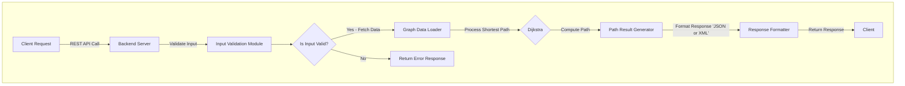
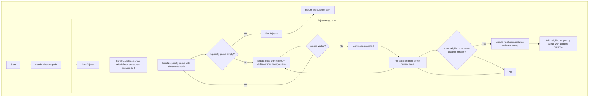

# Technical Specifications

<details>
    <summary>Table of contents</summary>

- [Technical Specifications](#technical-specifications)
  - [Project Overview](#project-overview)
  - [1. Introduction](#1-introduction)
    - [1.1 Purpose](#11-purpose)
    - [1.2 Scope](#12-scope)
    - [1.3 Audience](#13-audience)
    - [1.4 Convention](#14-convention)
      - [1.4.1 File tree and documents](#141-file-tree-and-documents)
      - [1.4.2 Code](#142-code)
        - [Quick Reminder](#quick-reminder)
          - [C Naming](#c-naming)
          - [C++ Naming](#c-naming-1)
  - [2. System Requirements](#2-system-requirements)
    - [2.1 Functional Requirements](#21-functional-requirements)
      - [2.1.1 Data Checker](#211-data-checker)
      - [2.1.2 REST API2](#212-rest-api2)
    - [2.2 Non-Functional Requirements](#22-non-functional-requirements)
      - [2.2.1 Data Checker](#221-data-checker)
      - [2.2.2 REST API2](#222-rest-api2)
  - [3. System Architecture](#3-system-architecture)
    - [3.1 Overview](#31-overview)
      - [3.1.1 Key Design Considerations](#311-key-design-considerations)
    - [3.2 Pathfinding4 Algorithms](#32-pathfinding4-algorithms)
      - [3.2.1 Dijkstra5's Algorithm](#321-dijkstra5s-algorithm)
    - [3.3 Data Flow Overview](#33-data-flow-overview)
      - [3.3.1 High-Level Data Flow Diagram](#331-high-level-data-flow-diagram)
      - [Explanation:](#explanation)
      - [3.3.2 Shortest Path Algorithm Execution Flow](#332-shortest-path-algorithm-execution-flow)
  - [4. Detailed Design](#4-detailed-design)
    - [4.1 Backend Design](#41-backend-design)
      - [4.1.1. REST API2 Endpoint](#411-rest-api2-endpoint)
      - [4.1.2. Request Handling Layer](#412-request-handling-layer)
      - [4.1.3. Pathfinding4 Engine](#413-pathfinding4-engine)
      - [4.1.4. Data Validation Tool Integration](#414-data-validation-tool-integration)
      - [4.1.5. Security Layer](#415-security-layer)
      - [4.1.6. Response Serialization39](#416-response-serialization39)
      - [4.1.7. Scalability28 Design](#417-scalability28-design)
      - [4.1.8. Testing and Monitoring](#418-testing-and-monitoring)
    - [4.3 Data Structure](#43-data-structure)
      - [4.3.1 Graph Characteristics](#431-graph-characteristics)
      - [4.3.2 Graph Properties](#432-graph-properties)
      - [4.3.3 Data Representation](#433-data-representation)
      - [4.3.4 Data Integrity33 Validation](#434-data-integrity33-validation)
    - [4.3.5 Usage in Pathfinding4](#435-usage-in-pathfinding4)
  - [5. Development Approach](#5-development-approach)
    - [5.1 Methodology](#51-methodology)
    - [5.2 Tools and Technologies](#52-tools-and-technologies)
    - [5.3 Libraries used](#53-libraries-used)
    - [5.4 Software](#54-software)
    - [5.5 Target](#55-target)
      - [5.5.1 Desktop Platforms](#551-desktop-platforms)
      - [5.5.2 Web Server for REST API2](#552-web-server-for-rest-api2)
    - [Notes:](#notes)
  - [6. Testing](#6-testing)
    - [6.1 Testing Strategy](#61-testing-strategy)
    - [6.2 Tools](#62-tools)
  - [7. Deployment](#7-deployment)
    - [7.1 Deployment Pipeline](#71-deployment-pipeline)
    - [7.2 Maintenance](#72-maintenance)
  - [8. Security](#8-security)
    - [8.1 Data Security](#81-data-security)
    - [8.2 Compliance](#82-compliance)
    - [8.3 Security Best Practices](#83-security-best-practices)
    - [8.4 Secure Development Practices](#84-secure-development-practices)
  - [9. Glossary](#9-glossary)

</details>


## Project Overview

The application is designed to determine the shortest path from Point A to Point B. It provides users with detailed step-by-step instructions for the journey, including intermediate landmarks and the estimated travel time for each segment[.][3]

## 1. Introduction

<br>

### 1.1 Purpose

The purpose of this document is to define the technical specifications for developing the pathfinding<sup>[4](#glossary-4)</sup> application. It offers a detailed overview of the system's requirements, architecture, core functionalities, and the development methodology to be followed[.][3]

### 1.2 Scope

The project encompasses the following key components, each tailored for cross-platform<sup>[19](#glossary-19)</sup> compatibility and developed using industry-standard technologies:

1. **Data Checker**
   - **Name:** `DAC (Data Analyzer for CAP)`
   - **Type:** Desktop Application
   - **Technology:** Developed in [C][2]
   - **Supported Platforms:** Linux, Windows, and macOS
2. **REST API**<sup>[2](#glossary-2)</sup>
   - **Name:** `CAP (Cap API Pathfinder)`
   - **Type:** Web API
   - **Technology:** Developed in [C++][1]
   - **Supported Platforms:** Platform-agnostic<sup>[3](#glossary-3)</sup>

### 1.3 Audience

This document is intended for the following audiences:

- `Project Managers:` To understand the scope, requirements, and technical details of the project for effective planning and coordination.
- `Software Engineers:` To gain detailed insights into the system architecture, design, and coding standards required for development.
- `UI/UX Designers:` To align their designs with the technical capabilities and limitations outlined in the specifications.
- `Quality Assurance Testers:` To prepare test plans and cases that ensure the application meets the outlined technical requirements.
- `Stakeholders:` To provide an overview of the project's technical aspects, ensuring alignment with business goals and expectations.

### 1.4 Convention


#### 1.4.1 File tree and documents

The naming conventions should be as follows:

| type    | convention     |
| ------- | -------------- |
| Folders | **snake_case** |
| Files   | **PascalCase** |

```md
2024-2025-project-3-quickest-path-team-5
└───documents
    ├───functional
    │   └─── FunctionalSpecifications.md
    ├───quality
    └───technical
        └─── TechnicalSpecifications.md
```

#### 1.4.2 Code

Our coding conventions are aligned with the standard practices and guidelines recommended for each programming language used in this project[.][3] By adhering to language-specific conventions and widely accepted best practices, we ensure code that is consistent, readable, and maintainable[.][3]

For this project, we have established a detailed set of coding conventions tailored to meet our specific requirements and promote collaboration across the team[.][3] These conventions cover aspects such as naming conventions, formatting rules, error handling, and use of language features[.][3]

You can find the full coding convention guidelines in the [Coding Conventions document](CodingConventions.md "Coding Conventions")[.][3]

##### Quick Reminder

###### C Naming
[][2]

<hr>

| Type              | Convention       |
| ----------------- | ---------------- |
| `Variables`       | snake_case       |
| `Constants`       | UPPER_SNAKE_CASE |
| `Functions`       | camelCase        |
| `Structs & Enums` | PascalCase       |

###### C++ Naming
[][1]
<hr>

| Type        | Convention       |
| ----------- | ---------------- |
| `Variables` | camelCase        |
| `Constants` | UPPER_SNAKE_CASE |
| `Functions` | camelCase        |
| `Class`     | PascalCase       |

## 2. System Requirements

<br>

### 2.1 Functional Requirements  

#### 2.1.1 Data Checker  

- **CSV<sup>[9](#glossary-9)</sup> File Import**  
  - Users should be able to import a CSV<sup>[9](#glossary-9)</sup> file into the application for validation[.][3] Supported formats should be clearly documented, and the system should reject invalid files with detailed feedback[.][3]  

- **Error Reporting**  
  - The application will display detailed error messages in the terminal, including row and column numbers, to help users identify and correct issues in the CSV<sup>[9](#glossary-9)</sup> file[.][3]  

- **Visual Representation of Linked Nodes<sup>[14](#glossary-14)</sup>**  
  - The application will generate a visual diagram displaying each node<sup>[14](#glossary-14)</sup> and its connections, using color-coded indicators for errors or anomalies in the data[.][3]  

- **Node<sup>[14](#glossary-14)</sup> and Connection Validation**  
  - The application will verify the integrity of the imported data, ensuring all nodes<sup>[14](#glossary-14)</sup> and connections are valid and consistent with the required format[.][3]  

<!-- TODO: Modify depending of software engineers implemented algo -->
- **Algorithm Complexity**  
  - The data validation algorithm used for checks, such as graph<sup>[8](#glossary-8)</sup> validation and connectivity, will operate with a time complexity<sup>[13](#glossary-13)</sup> of **[O(log n)][6]** for most operations, ensuring efficient processing of large datasets[.][3]

#### 2.1.2 REST API<sup>[2](#glossary-2)</sup>  

- **Endpoint for Shortest Path Calculation**  
  - Provide an endpoint that accepts input parameters (e.g., start point, end point) and returns the shortest path, including intermediate steps and estimated travel times[.][3]  

- **Error Handling and Status Codes**  
  - Ensure all API endpoints return appropriate HTTP<sup>[11](#glossary-11)</sup> status codes and detailed error messages for invalid requests or server errors[.][3]  

- **Authentication and Authorization**  
  - Secure the API using authentication (e.g., OAuth<sup>[20](#glossary-20)</sup> 2.0, API keys<sup>[21](#glossary-21)</sup>) and enforce role-based access control<sup>[24](#glossary-24)</sup> to restrict sensitive operations[.][3]

### 2.2 Non-Functional Requirements  

#### 2.2.1 Data Checker  

- **Compatibility**  
  - The application should be compatible with Linux, Windows, and macOS, supporting version 12 and the latest releases of each operating system[.][3]  

- **Usability**  
  - The interface should provide clear feedback during file imports and error highlighting to minimize user confusion[.][3]  
  - A help section or documentation link should be accessible from the interface for troubleshooting[.][3]  

- **Performance**  
  - The application should process CSV<sup>[9](#glossary-9)</sup> files and provide error feedback within **1 second** for standard datasets[.][3]  

#### 2.2.2 REST API<sup>[2](#glossary-2)</sup>  

- **Performance**  
  - The REST API<sup>[2](#glossary-2)</sup> should respond to requests within 200ms under normal conditions and support high throughput[.][3]  

- **Scalability<sup>[28](#glossary-28)</sup>**  
  - The backend should be designed to scale horizontally to handle a growing number of concurrent users efficiently[.][3]  

- **Compatibility**  
  - The REST API<sup>[2](#glossary-2)</sup> should be platform-agnostic<sup>[3](#glossary-3)</sup> and deployable on any server environment that supports the required C++ runtime and dependencies[.][3]  

- **Security**  
  - All endpoints should enforce authentication and authorization protocols to protect sensitive data[.][3]  
  - The deployed version of the API must adhere to industry-standard practices such as HTTPS for secure communication[.][3]  

- **Documentation**  
  - Comprehensive API documentation<sup>[23](#glossary-23)</sup> must be provided, including endpoint details, example requests/responses, and error codes[.][3]

## 3. System Architecture

<br>

### 3.1 Overview  

The system architecture is designed to ensure seamless functionality, high performance, and a user-friendly experience across all supported platforms[.][3] It consists of the following key components:   

- **Desktop Application (Data Checker)**  
  - **Technology**: Developed using [C][2] for its performance in handling data integrity<sup>[33](#glossary-33)</sup> checks[.][3]  
  - **Purpose**: A utility application used to validate the integrity of the dataset (e.g., CSV<sup>[9](#glossary-9)</sup> file) by verifying graph<sup>[8](#glossary-8)</sup> properties such as connectivity and absence of loops[.][3]  
  - **Supported Platforms**: Compatible with Linux, Windows, and macOS[.][3]  

- **REST API<sup>[2](#glossary-2)</sup>**  
  - **Technology**: Developed using [C++][1] to ensure platform-agnostic<sup>[3](#glossary-3)</sup> deployment[.][3]  
  - **Purpose**: Exposes core functionality through an HTTP<sup>[11](#glossary-11)</sup> server, providing endpoints for calculating shortest paths, managing data, and retrieving results in multiple formats (e.g., JSON<sup>[16](#glossary-16)</sup> or XML<sup>[17](#glossary-17)</sup>)[.][3]  
  - **Compatibility**: Designed to be deployable on any server environment that supports the required C++ runtime[.][3]  

- **Authentication Service**  
  - **Technology**: Integrated with the REST API<sup>[2](#glossary-2)</sup>, potentially using industry-standard authentication methods (e.g., OAuth<sup>[20](#glossary-20)</sup> 2.0, API keys<sup>[21](#glossary-21)</sup>)[.][3]  
  - **Purpose**: Ensures secure access to the REST API<sup>[2](#glossary-2)</sup> by validating user credentials and managing authorization[.][3]  
  - **Scalability<sup>[28](#glossary-28)</sup>**: Supports role-based access control<sup>[24](#glossary-24)</sup> for future scalability<sup>[28](#glossary-28)</sup> and extended functionality[.][3]  

#### 3.1.1 Key Design Considerations

- **Modular Design<sup>[27](#glossary-27)</sup>**: Each component is designed to operate independently, ensuring maintainability and ease of updates[.][3]  
- **High Performance**: The architecture prioritizes efficiency to handle large datasets and complex computations within the defined performance constraints[.][3]  
- **Cross-Platform<sup>[19](#glossary-19)</sup> Support**: Desktop applications and the REST API<sup>[2](#glossary-2)</sup> are built to function seamlessly across Linux, Windows, and macOS[.][3]  
- **Extensibility**: The system is designed to accommodate future enhancements, such as adding new endpoints, improving UI/UX, or integrating with external services[.][3]  

### 3.2 Pathfinding<sup>[4](#glossary-4)</sup> Algorithms 

To complete this project, we employ two robust algorithms, **Dijkstra<sup>[5](#glossary-5)</sup>'s Algorithm**, to balance fast runtime and accuracy in pathfinding<sup>[4](#glossary-4)</sup>[.][3]  

#### 3.2.1 Dijkstra<sup>[5](#glossary-5)</sup>'s Algorithm  
- **Purpose:**  
  Finds the shortest path between two landmarks in a graph<sup>[8](#glossary-8)</sup>[.][3]  
- **Advantages:**  
  - Guarantees the shortest path[.][3]  
  - Works well when all edge<sup>[15](#glossary-15)</sup> weights are non-negative[.][3]  
- **Usage in the Project:**  
  Dijkstra<sup>[5](#glossary-5)</sup>'s algorithm is used for cases where simplicity and guaranteed accuracy are prioritized over speed[.][3]  

### 3.3 Data Flow Overview

Below is a high-level representation of the data flow in the system using a Mermaid<sup>[10](#glossary-10)</sup> diagram:  

#### 3.3.1 High-Level Data Flow Diagram



#### Explanation:  

1. **Client Request:**  
   - The process begins when a **client** sends a **REST API**<sup>[2](#glossary-2)</sup> request to the **Backend Server**. The request contains the source and destination landmarks (nodes<sup>[14](#glossary-14)</sup>) for which the shortest path is required[.][3]
2. **Input Validation Module:**  
   - The **Backend Server** forwards the request to the **Input Validation Module**, which checks the validity of the input (e.g., valid IDs, non-empty input)[.][3] This involves verifying that the provided source and destination nodes<sup>[14](#glossary-14)</sup> exist and that the parameters are correctly formatted[.][3] If the input is valid, the system proceeds; otherwise, an error response is returned to the client[.][3]
3. **Graph Data Loader:**  
   - If the input is valid, the **Graph Data Loader** retrieves the relevant **graph<sup>[8](#glossary-8)</sup> data** (nodes<sup>[14](#glossary-14)</sup> and edges<sup>[15](#glossary-15)</sup>) from the dataset and loads it into memory[.][3] This data will be used in the next steps to compute the shortest path[.][3]
4. **Dijkstra's Algorithm Execution:**  
   - The **Dijkstra's algorithm** to compute the shortest path[.][3] The algorithm calculates the minimal path by evaluating the edges<sup>[15](#glossary-15)</sup> and nodes<sup>[14](#glossary-14)</sup> of the graph based on their weights (distances or costs)[.][3]
5. **Path Result Generator:**  
   - Once the algorithm completes, the **Path Result Generator** processes the results[.][3] It converts the raw output (a list of nodes<sup>[14](#glossary-14)</sup> in the shortest path, including distances) into a structured format that can be easily understood by the client[.][3]
6. **Response Formatter:**  
   - The **Response Formatter** takes the processed data and formats it according to the client's request (either **JSON**<sup>[16](#glossary-16)</sup> or **XML**<sup>[17](#glossary-17)</sup>)[.][3] This ensures that the output is compatible with the client's expected format[.][3]
7. **Client Response:**  
   - Finally, the **Backend Server** sends the formatted response back to the **client**, which contains the shortest path from the source to the destination, including details like travel times or distances between intermediate nodes<sup>[14](#glossary-14)</sup>[.][3]
8. **Error Handling:**  
   - If at any point the input validation fails, the system will return an error response (using appropriate HTTP status codes), which will be received by the client[.][3]


#### 3.3.2 Shortest Path Algorithm Execution Flow



## 4. Detailed Design

<br>

### 4.1 Backend Design

The backend is structured to handle multiple requests efficiently and securely[.][3] Key components include:

#### 4.1.1. REST API<sup>[2](#glossary-2)</sup> Endpoint
- **Purpose**: Provides access to the core functionality of the application through a single GET endpoint[.][3]  
- **Input**: Accepts source and destination landmark IDs as query parameters[.][3]  
- **Output**: Returns the travel time and the ordered list of landmarks in the shortest path in both `XML`<sup>[17](#glossary-17)</sup> and `JSON`<sup>[16](#glossary-16)</sup> formats[.][3]  
- **Design**: Built using C++ for high performance, leveraging lightweight HTTP<sup>[11](#glossary-11)</sup> server libraries such as `Boost.Beast`, `cpp-httplib` or `Pistache`[.][3]

#### 4.1.2. Request Handling Layer
- **Purpose**: Parses incoming requests, validates inputs, and routes them to the appropriate modules[.][3]  
- **Error Handling**: Ensures that invalid or incomplete requests return descriptive error messages (e.g., `400 Bad Request`)[.][3]  
- **Concurrency<sup>[32](#glossary-32)</sup>**: Supports handling multiple requests simultaneously using threading<sup>[42](#glossary-42)</sup> or asynchronous techniques[.][3]

#### 4.1.3. Pathfinding<sup>[4](#glossary-4)</sup> Engine
- **Purpose**: Implements the core algorithm for finding the shortest path between two landmarks[.][3]  
- **Algorithm**: Utilizes Dijkstra<sup>[5](#glossary-5)</sup>’s  algorithm for optimal precision and DFS<sup>[6](#glossary-6)</sup> for optimal performance[.][3]  
- **Data Loading**: Reads the graph<sup>[8](#glossary-8)</sup> data (from `USA-roads.csv`) into memory during initialization to optimize query response times[.][3]  
- **Performance Goals**: Ensures responses within 1 second for typical requests[.][3]

#### 4.1.4. Data Validation Tool Integration
- **Purpose**: Verifies the integrity of the graph<sup>[8](#glossary-8)</sup> data before it is loaded into memory[.][3]  
- **Functionality**: Ensures that the dataset forms a fully connected graph<sup>[8](#glossary-8)</sup> and is free of loops[.][3]  
- **Implementation**: Operates as a pre-processing step, run infrequently but essential for ensuring data accuracy[.][3]

#### 4.1.5. Security Layer
- **Purpose**: Protects the REST API<sup>[2](#glossary-2)</sup> from unauthorized access[.][3]  
- **Implementation**:  
  - API key-based<sup>[21](#glossary-21)</sup> authentication for identifying and authorizing clients[.][3]  
  - Input sanitization<sup>[41](#glossary-41)</sup> to prevent injection attacks[.][3]  
  - Rate limiting<sup>[35](#glossary-35)</sup> to mitigate DoS (Denial of Service<sup>[52](#glossary-52)</sup>) attacks[.][3]

#### 4.1.6. Response Serialization<sup>[39](#glossary-39)</sup>
- **Purpose**: Converts the output of the pathfinding<sup>[4](#glossary-4)</sup> engine into the requested format (XML<sup>[17](#glossary-17)</sup> or JSON<sup>[16](#glossary-16)</sup>)[.][3]  
- **Design**: Utilizes lightweight serialization<sup>[39](#glossary-39)</sup> libraries to minimize overhead while maintaining compatibility with modern REST standards[.][3]

#### 4.1.7. Scalability<sup>[28](#glossary-28)</sup> Design
- **Purpose**: Prepares the backend for increasing traffic and data loads[.][3]  
- **Techniques**:  
  - Modular architecture<sup>[43](#glossary-43)</sup> to allow easy scaling of individual components[.][3]  
  - Potential integration with a load balancer<sup>[40](#glossary-40)</sup> for distributed deployments in production environments[.][3]

#### 4.1.8. Testing and Monitoring
- **Unit Testing<sup>[47](#glossary-47)</sup>**: Comprehensive test suite to validate the correctness of each backend component[.][3]  
- **Performance Testing**: Ensures the API meets the 1-second response time requirement under normal conditions[.][3]  
- **Logging and Monitoring**: Captures API usage and performance metrics to diagnose issues and optimize performance over time[.][3]

### 4.3 Data Structure

The application relies on a **weighted, undirected graph<sup>[8](#glossary-8)</sup>** to model the road network of landmarks and travel times[.][3] This graph structure serves as the foundation for implementing efficient pathfinding<sup>[4](#glossary-4)</sup> algorithms and ensuring accurate results within the defined performance constraints[.][3]

#### 4.3.1 Graph Characteristics

- **Nodes<sup>[14](#glossary-14)</sup> (Vertices<sup>[18](#glossary-18)</sup>):**  
  Represent landmarks in the road network[.][3] Each node<sup>[14](#glossary-14)</sup> is uniquely identified by a landmark ID[.][3]

- **Edges<sup>[15](#glossary-15)</sup>:**  
  Represent bidirectional roads connecting two landmarks[.][3] Each edge<sup>[15](#glossary-15)</sup> has a weight, which corresponds to the travel time between the two connected landmarks[.][3]

- **Weights:**  
  Edge<sup>[15](#glossary-15)</sup> weights are integer values representing travel time in an unspecified unit[.][3] Lower weights indicate shorter travel times[.][3]

#### 4.3.2 Graph Properties

- **Weighted:**  
  Each edge<sup>[15](#glossary-15)</sup> has a numerical value (weight) representing travel time[.][3]

- **Undirected:**  
  Roads are bidirectional[.][3] If an edge<sup>[15](#glossary-15)</sup> exists from landmark A to landmark B, the reverse is also true[.][3]

- **Cyclic:**  
  The graph<sup>[8](#glossary-8)</sup> inherently contains cycles, as multiple paths often connect landmarks[.][3]

- **Sparse Graph:**  
  Since real-world road networks are typically sparse (many fewer edges<sup>[15](#glossary-15)</sup> than the maximum possible), efficient data structures are used to optimize memory and runtime performance[.][3]

#### 4.3.3 Data Representation

The graph<sup>[8](#glossary-8)</sup> will be implemented using the following data structures for optimal performance and scalability<sup>[28](#glossary-28)</sup>:

1. **Adjacency List<sup>[29](#glossary-29)</sup>:**  
   - Used for representing the graph<sup>[8](#glossary-8)</sup>[.][3] Each node<sup>[14](#glossary-14)</sup> maintains a list of its neighbors and associated weights (travel times)[.][3]  
   - Efficient for sparse graphs, as it minimizes memory usage[.][3]

   **Example:**  
   ```text
    Node A: [(B, 5), (C, 10)]  
    Node B: [(A, 5), (C, 3)]  
    Node C: [(A, 10), (B, 3)]
   ```  
2. **Hash Map<sup>[34](#glossary-34)</sup> for Node<sup>[14](#glossary-14)</sup> Lookup:**
   - A hash map<sup>[34](#glossary-34)</sup> (or dictionary) is used for fast lookup of nodes<sup>[14](#glossary-14)</sup> by their landmark IDs[.][3]

   **Example:**
    ```cpp
    std::unordered_map<int, std::vector<std::pair<int, int>>> graph;
    Priority Queue (for Pathfinding):
    ```

3. **Priority Queue<sup>[30](#glossary-30)</sup> (for Pathfinding<sup>[4](#glossary-4)</sup>):**
   - Utilized in algorithms like Dijkstra<sup>[5](#glossary-5)</sup> to efficiently retrieve the next node<sup>[14](#glossary-14)</sup> with the shortest travel time[.][3]
   - Typically implemented as a min-heap[.][3]

   **Example:**
    ```cpp
    std::priority_queue<std::pair<int, int>, std::vector<std::pair<int, int>>, std::greater<>> minHeap;
    ```
#### 4.3.4 Data Integrity<sup>[33](#glossary-33)</sup> Validation
To ensure the correctness of the graph structure<sup>[8](#glossary-8)</sup>, the following validation steps are performed during the data import phase:

1. **Self-Loop Check:**
   - Ensure no edge<sup>[15](#glossary-15)</sup> connects a node<sup>[14](#glossary-14)</sup> to itself (e.g., `A -> A`)[.][3]

2. **Duplicate Edge<sup>[15](#glossary-15)</sup> Check:**
   - Verify that no duplicate edges<sup>[15](#glossary-15)</sup> exist between two nodes<sup>[14](#glossary-14)</sup> with differing weights[.][3]

3. **Connectivity Check:**
   - Confirm the graph<sup>[8](#glossary-8)</sup> is fully connected, ensuring all nodes<sup>[14](#glossary-14)</sup> are reachable from any other node<sup>[14](#glossary-14)</sup>[.][3]

4. **Symmetry Check:**
   - Ensure bidirectionality of all edges<sup>[15](#glossary-15)</sup> (e.g., if `A -> B` exists, `B -> A` must also exist with the same weight)[.][3]

### 4.3.5 Usage in Pathfinding<sup>[4](#glossary-4)</sup>
The weighted, undirected graph<sup>[8](#glossary-8)</sup> is optimized for algorithms like **Dijkstra<sup>[5](#glossary-5)</sup>** to calculate the shortest path efficiently[.][3] This algorithm leverage the graph structure and priority queue<sup>[30](#glossary-30)</sup> to balance performance and memory usage, ensuring the application meets its response time requirements[.][3]


## 5. Development Approach

<br>

### 5.1 Methodology

The project will follow the Agile methodology, with development broken down into sprints[.][3] Each sprint will focus on specific features and improvements, allowing for iterative development and continuous feedback[.][3]

### 5.2 Tools and Technologies

| Category                            | Tools/Technologies used                                                                                                          |
| ----------------------------------- | -------------------------------------------------------------------------------------------------------------------------------- |
| Data Checking Application           | C<sup>99</sup> to keep a fast runtime but using a mastered language of our software engineer[.][3]                               |
| REST API<sup>[2](#glossary-2)</sup> | C++<sup>17</sup> to keep a fast runtime and not using to many unnecessary language keeping the project easily maintainable[.][3] |
| Response Format                     | JSON<sup>[16](#glossary-16)</sup> but we want to implement the possibility to get XML<sup>[17](#glossary-17)</sup> also          |
| Version Control                     | Git with GitHub[.][3]                                                                                                            |
| CI/CD<sup>[1](#glossary-1)</sup>    | GitHub Actions for continuous integration and deployment[.][3]                                                                   |

### 5.3 Libraries used

| C++ Library Name                | Version    | Description                                                                                                          | Links                                                           |
| ------------------------------- | ---------- | -------------------------------------------------------------------------------------------------------------------- | --------------------------------------------------------------- |
| Standard Template Library (STL) | **C++11+** | Provides a collection of generic classes and functions, such as vectors, lists, stacks, queues, and algorithms[.][3] | [Reference](https://en.cppreference.com/w/cpp/standard_library) |

<!-- TODO: Add all used C++ libs and add a new table with C libs -->

### 5.4 Software

| Name  | Link                                               |
| ----- | -------------------------------------------------- |
| CMake | [Install](https://cmake.org/download/)             |
| Clang | [Install](https://clang.llvm.org/get_started.html) |

### 5.5 Target

We decided to target the following platforms for compatibility, performance, and user reach:

#### 5.5.1 Desktop Platforms

| Platform    | Supported Versions                             | Rationale                                                                                            |
| ----------- | ---------------------------------------------- | ---------------------------------------------------------------------------------------------------- |
| **Linux**   | Distributions with GCC/Clang and C++17 support | Ensures compatibility with the majority of modern Linux distributions[.][3]                          |
| **Windows** | Windows 10 and later                           | Covers the largest user base, with extended support for performance and compatibility[.][3]          |
| **macOS**   | macOS 14 (Sequoia) and later                   | Targets devices capable of running modern macOS features and supporting your development tools[.][3] |

#### 5.5.2 Web Server for REST API<sup>[2](#glossary-2)</sup>

| Server Type                                   | Supported Platforms      | Rationale                                                                                                     |
| --------------------------------------------- | ------------------------ | ------------------------------------------------------------------------------------------------------------- |
| **HTTP<sup>[11](#glossary-11)</sup> Servers** | Linux, Windows, macOS    | Platform-agnostic<sup>[3](#glossary-3)</sup> support ensures flexibility for deployment and development[.][3] |
| **Localhost**                                 | Development environments | Simplifies testing and debugging during the development phase[.][3]                                           |

---

### Notes:
1. **macOS Targeting:**  
   - **macOS 14 (Sequoia)** is the primary target version for this project[.][3]  
   - **macOS 13 (Ventura)** and **macOS 12 (Monterey)** are supported, systems running earlier versions may still work but are not officially supported[.][3]

2. **Cross-Platform<sup>[19](#glossary-19)</sup> Compatibility:**  
   - By leveraging C++ and standardized libraries, the project ensures a seamless experience across major desktop platforms[.][3]  
   - The REST API<sup>[2](#glossary-2)</sup> is developed to work with any platform hosting an HTTP<sup>[11](#glossary-11)</sup> server capable of supporting the required runtime[.][3]

## 6. Testing

<br>

### 6.1 Testing Strategy

Unit Testing<sup>[47](#glossary-47)</sup>: For individual components and functions[.][3]
Integration Testing<sup>[48](#glossary-48)</sup>: To ensure different parts of the application work together[.][3]
System Testing<sup>[49](#glossary-49)</sup>: To test the complete system as a whole[.][3]

The detailed testing strategy can be seen in the test plan: [HERE](QA/TestPlan.md)

### 6.2 Tools

Unit Testing<sup>[47](#glossary-47)</sup>: Wrote by our Quality Assurance team and ran with googleTest[.][3]
CI/CD<sup>[1](#glossary-1)</sup> Testing: Automated testing using GitHub Actions[.][3]

## 7. Deployment

<br>

### 7.1 Deployment Pipeline

Staging Environment: For pre-production testing[.][3]
Production Environment: For the live application[.][3]

### 7.2 Maintenance

Regular updates and bug fixes based on user feedback and performance metrics[.][3]

## 8. Security

### 8.1 Data Security

Since the application is designed for local use (on a local server), the security measures will primarily focus on securing data in transit and ensuring the proper handling of the dataset[.][3] Here's how data security is managed:

- **Encryption:**
  - Communication between the client and server will be done over **HTTP<sup>[11](#glossary-11)</sup>** since the system operates in a localhost environment[.][3]
  - Although we will not implement HTTPS or SSL<sup>[12](#glossary-12)</sup> for localhost, it's highly recommended that in production environments (if the project is moved to the internet), **HTTPS** and **SSL<sup>[12](#glossary-12)</sup>/TLS** encryption will be enabled to secure the data transmitted between the client and server[.][3]
  - Since the application doesn’t store user data, encryption is not necessary for data at rest[.][3] The only data that exists is the CSV<sup>[9](#glossary-9)</sup> file, which is stored on the server[.][3]

- **Data Integrity<sup>[33](#glossary-33)</sup>:**
  - We use a **CSV file** as the primary data source (which contains nodes<sup>[14](#glossary-14)</sup> and connections)[.][3] Data integrity<sup>[33](#glossary-33)</sup> checks can be implemented to ensure that the CSV<sup>[9](#glossary-9)</sup> file is properly formatted and that there are no data inconsistencies[.][3]
  - We will validate the CSV<sup>[9](#glossary-9)</sup> file’s integrity before uploading it on the live server to ensure that it is not corrupted, and we will also validate that it meets the expected structure (i.e., a **DAG** with no loops)[.][3]

- **API Security:**
  - Since we are not implementing a user authentication system (e.g., no login or registration), there is no need to secure API endpoints with authentication tokens for this local version[.][3]
  - For security purposes, if this application were to move to a public server or production environment, we would recommend using API tokens or another form of authentication (such as **OAuth<sup>[20](#glossary-20)</sup>** or **Bearer Tokens**) to secure access to the endpoints[.][3]

### 8.2 Compliance

- **GDPR (General Data Protection Regulation):**
  - The application does not collect or store personal data from users[.][3] As the only data involved is the CSV<sup>[9](#glossary-9)</sup> file, there are no concerns regarding the collection of personal information[.][3]
  - Since the CSV<sup>[9](#glossary-9)</sup> file may contain geographic or landmark data, if any sensitive data were to be involved (in future versions), we would ensure compliance with GDPR, including user consent, data deletion, and data protection procedures[.][3]

- **Data Breach Notification:**
  - There is no personally identifiable information (PII) being processed or stored in this system[.][3] However, if sensitive data were to be added in the future, we would establish a process to notify users in case of any data breaches (as per GDPR guidelines)[.][3]

- **Other Regulations:**
  - The current version of the system is not handling sensitive personal data, so no other regulations like **HIPAA** or **CCPA** apply[.][3] However, should the project evolve to handle user data in the future, compliance with these and other data protection regulations would be enforced[.][3]

### 8.3 Security Best Practices

- **CSV File Validation:**
  - We perform data validation checks on the CSV<sup>[9](#glossary-9)</sup> file to ensure that it contains valid and consistent data before it's processed by the application[.][3] This step helps prevent errors caused by malformed data[.][3]
  - The application will verify that the CSV<sup>[9](#glossary-9)</sup> file adheres to the expected format: **Landmark_A_ID, Landmark_B_ID, Time**[.][3] It will also check that the graph<sup>[8](#glossary-8)</sup> is valid, meaning it is a **Directed Acyclic Graph (DAG)** with no loops[.][3]

- **Localhost Environment Security:**
  - Since the system is running on localhost, it’s assumed that access is restricted to the local machine or local network[.][3]
  - We recommend ensuring that only authorized personnel can access the local server during testing and development[.][3] This can be done by restricting server access to local IP addresses (127.0.0.1) and using firewalls if necessary[.][3]
  
- **Data Storage:**
  - As the application does not store personal data, no sensitive information needs to be protected[.][3] However, for the CSV<sup>[9](#glossary-9)</sup> file stored on the server, it is important to restrict access to prevent unauthorized modifications to the file[.][3]
  - We recommend using file system permissions to restrict access to the server where the CSV<sup>[9](#glossary-9)</sup> file is stored[.][3]

### 8.4 Secure Development Practices

- **Code Review and Secure Coding:**
  - We follow secure coding practices to prevent vulnerabilities such as buffer overflows<sup>[50](#glossary-50)</sup>, code injection, and other common vulnerabilities[.][3] Any code changes are reviewed to ensure adherence to security standards[.][3]
  - Proper **input validation** is implemented to prevent issues when processing data from the CSV<sup>[9](#glossary-9)</sup> file[.][3]

- **Regular Updates:**
  - We will ensure that the system, especially the server environment, is regularly updated with security patches to minimize the risk of exploits[.][3]

- **Environment Configuration:**
  - We ensure that the development and deployment environment is configured securely[.][3] Since this application will be running on localhost, it is essential to properly configure any local servers and ensure they are only accessible from authorized machines[.][3]


## 9. Glossary

| Id                         | Term                                                                         | Definition                                                                                                                                                                                                                                                                               |
| -------------------------- | ---------------------------------------------------------------------------- | ---------------------------------------------------------------------------------------------------------------------------------------------------------------------------------------------------------------------------------------------------------------------------------------- |
| <p id="glossary-1">1</p>   | CI/CD (Continuous Integration/Continuous Deployment)                         | Practices that automate the integration of code changes (CI) and deployment of applications (CD) to ensure reliable, fast software delivery.                                                                                                                                             |
| <p id="glossary-2">2</p>   | REST API (Representational State Transfer Application Programming Interface) | A set of rules for building and interacting with web services that allow clients to communicate with the server over HTTP using methods like GET, POST, PUT, DELETE.                                                                                                                     |
| <p id="glossary-3">3</p>   | Platform agnostic                                                            | Platform agnostic refers to software, applications, or services designed to operate across various operating systems, device types, web browsers, or other foundational technologies.                                                                                                    |
| <p id="glossary-4">4</p>   | Pathfinding                                                                  | Pathfinding refers to the process of finding the shortest or most efficient route between two points in a map or network.                                                                                                                                                                |
| <p id="glossary-5">5</p>   | Dijkstra's Algorithm                                                         | A well-known algorithm used to find the shortest paths between nodes in a graph, ensuring that the shortest path is found from a starting node to all other nodes in a weighted graph.                                                                                                   |
| <p id="glossary-6">6</p>   | DFS (Depth First Search)                                                     | Depth-first search (DFS) is an algorithm for traversing or searching tree or graph data structures. The algorithm starts at the root node (selecting some arbitrary node as the root node in the case of a graph) and explores as far as possible along each branch before backtracking. |
| <p id="glossary-7">7</p>   | Heuristic                                                                    | A problem-solving approach that uses practical methods or shortcuts to produce a solution that is not guaranteed to be optimal but is sufficient for the immediate goal.                                                                                                                 |
| <p id="glossary-8">8</p>   | Graph Data Structure                                                         | A collection of nodes (or vertices) and edges that connect pairs of nodes, used to represent networks such as road maps, social connections, or communication systems.                                                                                                                   |
| <p id="glossary-9">9</p>   | CSV (Comma-Separated Values)                                                 | A file format used to store tabular data, where each line represents a row, and each value is separated by a comma.                                                                                                                                                                      |
| <p id="glossary-10">10</p> | Mermaid                                                                      | JavaScript based diagramming and charting tool that renders Markdown-inspired text definitions to create and modify diagrams dynamically.                                                                                                                                                |
| <p id="glossary-11">11</p> | HTTP (Hypertext Transfer Protocol)                                           | A protocol used for transferring data over the web, enabling the communication between a client (such as a web browser) and a server.                                                                                                                                                    |
| <p id="glossary-12">12</p> | SSL (Secure Sockets Layer)                                                   | A security protocol that establishes an encrypted link between a web server and a browser, ensuring secure data transfer over the internet.                                                                                                                                              |
| <p id="glossary-13">13</p> | Time Complexity (O(log n))                                                   | A way of expressing the efficiency of an algorithm, indicating how the time to run the algorithm increases as the size of the input grows.                                                                                                                                               |
| <p id="glossary-14">14</p> | Node                                                                         | A fundamental unit in a graph, typically representing an entity, such as a location in a pathfinding algorithm.                                                                                                                                                                          |
| <p id="glossary-15">15</p> | Edge                                                                         | A connection between two nodes in a graph, often with an associated weight that represents the cost or distance between the nodes.                                                                                                                                                       |
| <p id="glossary-16">16</p> | JSON (JavaScript Object Notation)                                            | A lightweight data-interchange format used for transmitting data in a human-readable form, typically between a server and a client.                                                                                                                                                      |
| <p id="glossary-17">17</p> | XML (Extensible Markup Language)                                             | A markup language that defines rules for encoding documents in a format that is both human-readable and machine-readable.                                                                                                                                                                |
| <p id="glossary-18">18</p> | Vertices (plural of vertex)                                                  | In discrete mathematics, and more specifically in graph theory, a vertex (plural vertices) or node is the fundamental unit of which graphs are formed.                                                                                                                                   |
| <p id="glossary-19">19</p> | Cross-Platform                                                               | Refers to software that can run on multiple operating systems, such as Windows, macOS, and Linux.                                                                                                                                                                                        |
| <p id="glossary-20">20</p> | OAuth                                                                        | A protocol for token-based authentication and authorization on the internet, allowing third-party services to exchange web resources on behalf of a user.                                                                                                                                |
| <p id="glossary-21">21</p> | API Key                                                                      | A unique identifier used to authenticate a client when making API requests, ensuring secure communication between the client and the server.                                                                                                                                             |
| <p id="glossary-23">23</p> | API Documentation                                                            | A reference guide that provides detailed information about an API’s endpoints, parameters, responses, and error codes, aiding developers in using the API.                                                                                                                               |
| <p id="glossary-24">24</p> | Role-Based Access Control (RBAC)                                             | A method of restricting system access based on the roles assigned to users, ensuring that users have access only to the resources necessary for their roles.                                                                                                                             |
| <p id="glossary-25">25</p> | Euclidean Distance                                                           | The straight-line distance between two points in Euclidean space, often used in pathfinding algorithms as a heuristic.                                                                                                                                                                   |
| <p id="glossary-26">26</p> | Manhattan Distance                                                           | A type of distance measurement used in pathfinding that calculates the distance between two points by only moving along grid lines (i.e., horizontal and vertical).                                                                                                                      |
| <p id="glossary-27">27</p> | Modular Design                                                               | A software design approach that splits a system into separate, self-contained modules, each responsible for a specific functionality, making the system easier to maintain and extend.                                                                                                   |
| <p id="glossary-28">28</p> | Scalability                                                                  | The capability of a system to handle a growing amount of work or to accommodate growth, especially in terms of system capacity, number of users, or data volume.                                                                                                                         |
| <p id="glossary-29">29</p> | Adjacency List                                                               | A way of representing a graph, where each node points to a list of all other nodes it is directly connected to by edges.                                                                                                                                                                 |
| <p id="glossary-30">30</p> | Priority Queue (Min-Heap)                                                    | A data structure that allows efficient retrieval of the element with the highest or lowest priority. A min-heap ensures that the smallest element is always at the top.                                                                                                                  |
| <p id="glossary-32">32</p> | Concurrency                                                                  | The ability of a system to handle multiple tasks or requests at the same time, often used to improve performance in multi-threaded applications.                                                                                                                                         |
| <p id="glossary-33">33</p> | Data Integrity                                                               | The accuracy, consistency, and reliability of data throughout its lifecycle, ensuring that it is not corrupted or altered incorrectly.                                                                                                                                                   |
| <p id="glossary-34">34</p> | Hash Map (Dictionary)                                                        | A data structure that stores key-value pairs, allowing for fast retrieval of values based on their corresponding keys.                                                                                                                                                                   |
| <p id="glossary-35">35</p> | Rate Limiting                                                                | A technique used to control the amount of incoming requests to a system in a given time period, helping to prevent overloads or abuse.                                                                                                                                                   |
| <p id="glossary-39">39</p> | Serialization                                                                | The process of converting an object into a format (like JSON or XML) that can be easily stored or transmitted and later reconstructed.                                                                                                                                                   |
| <p id="glossary-40">40</p> | Load Balancer                                                                | A system or tool used to distribute incoming network traffic across multiple servers, improving performance and reliability.                                                                                                                                                             |
| <p id="glossary-41">41</p> | Input Sanitization                                                           | The process of cleaning user inputs to ensure they do not contain malicious code or invalid data, helping to prevent security vulnerabilities like SQL injection.                                                                                                                        |
| <p id="glossary-42">42</p> | Threading                                                                    | A method of executing multiple parts of a program simultaneously in different threads, helping improve the efficiency and performance of multi-core processors.                                                                                                                          |
| <p id="glossary-43">43</p> | Modular Architecture                                                         | A design approach that divides a system into smaller, self-contained components, making it easier to scale, maintain, and improve individual parts of the system.                                                                                                                        |
| <p id="glossary-47">47</p> | Unit Testing                                                                 | A software testing method where individual components or functions are tested in isolation to verify their correctness.                                                                                                                                                                  |
| <p id="glossary-48">48</p> | Integration Testing                                                          | Testing the combination of multiple components of the system to ensure they work together as expected.                                                                                                                                                                                   |
| <p id="glossary-49">49</p> | System Testing                                                               | Testing the complete and integrated system to verify that it functions as a whole and meets the project requirements.                                                                                                                                                                    |
| <p id="glossary-50">50</p> | Buffer Overflow                                                              | A situation where a program writes more data to a buffer than it can hold, potentially leading to unexpected behavior or security vulnerabilities.                                                                                                                                       |
| <p id="glossary-52">52</p> | Denial of Service (DoS) Attacks                                              | A type of cyberattack where the attacker attempts to make a machine or network resource unavailable to its intended users by overwhelming it with requests.                                                                                                                              |


<!-- LINKS -->
[1]: https://en.wikipedia.org/wiki/C%2B%2B "C++ Wikipedia"
[2]: https://en.wikipedia.org/wiki/C_(programming_language) "C Wikipedia"
[3]: https://www.youtube.com/watch?v=tas0O586t80 "Program in C"
[4]: https://en.wikipedia.org/wiki/JSON "JSON Wikipedia"
[5]: https://en.wikipedia.org/wiki/XML "XML Wikipedia"
[6]: https://en.wikipedia.org/wiki/Time_complexity#Logarithmic_time "Logarithmic time Wikipedia"