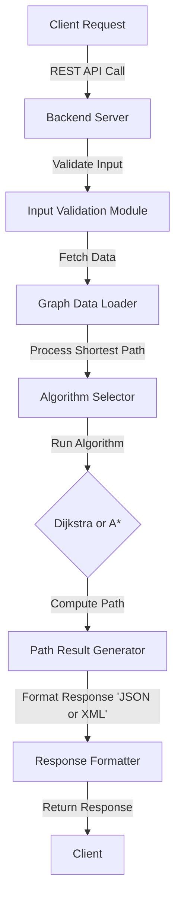
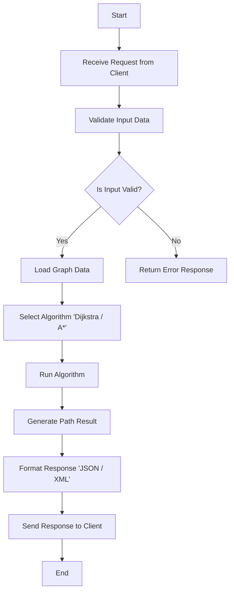

# Technical Specifications

<details>
    <summary>Table of contents</summary>

- [Technical Specifications](#technical-specifications)
  - [Project Overview](#project-overview)
  - [1. Introduction](#1-introduction)
    - [1.1 Purpose](#11-purpose)
    - [1.2 Scope](#12-scope)
    - [1.3 Audience](#13-audience)
    - [1.4 Convention](#14-convention)
      - [1.4.1 File tree and documents](#141-file-tree-and-documents)
      - [1.4.2 Code](#142-code)
        - [Quick Reminder](#quick-reminder)
          - [C Naming](#c-naming)
          - [C++ Naming](#c-naming-1)
  - [2. System Requirements](#2-system-requirements)
    - [2.1 Functional Requirements](#21-functional-requirements)
      - [2.1.1 Data Checker](#211-data-checker)
      - [2.1.2 REST API](#212-rest-api)
    - [2.2 Non-Functional Requirements](#22-non-functional-requirements)
      - [2.2.1 Data Checker](#221-data-checker)
      - [2.2.2 REST API](#222-rest-api)
  - [3. System Architecture](#3-system-architecture)
    - [3.1 Overview](#31-overview)
      - [3.1.1 Key Design Considerations](#311-key-design-considerations)
    - [3.2 Pathfinding Algorithms](#32-pathfinding-algorithms)
      - [3.2.1 Dijkstra's Algorithm](#321-dijkstras-algorithm)
      - [3.2.2 A\* Algorithm](#322-a-algorithm)
      - [3.2.3 Algorithm Selection Process](#323-algorithm-selection-process)
      - [3.2.4 Integration](#324-integration)
    - [3.3 Data Flow](#33-data-flow)
      - [Explanation:](#explanation)
    - [3.4 Flow Chart](#34-flow-chart)
      - [Explanation:](#explanation-1)
  - [4. Detailed Design](#4-detailed-design)
    - [4.1 Backend Design](#41-backend-design)
      - [4.1.1. REST API Endpoint](#411-rest-api-endpoint)
      - [4.1.2. Request Handling Layer](#412-request-handling-layer)
      - [4.1.3. Pathfinding Engine](#413-pathfinding-engine)
      - [4.1.4. Data Validation Tool Integration](#414-data-validation-tool-integration)
      - [4.1.5. Security Layer](#415-security-layer)
      - [4.1.6. Response Serialization](#416-response-serialization)
      - [4.1.7. Scalability Design](#417-scalability-design)
      - [4.1.8. Testing and Monitoring](#418-testing-and-monitoring)
    - [4.3 Data Structure](#43-data-structure)
      - [4.3.1 Graph Characteristics](#431-graph-characteristics)
      - [4.3.2 Graph Properties](#432-graph-properties)
      - [4.3.3 Data Representation](#433-data-representation)
      - [4.3.4 Data Integrity Validation](#434-data-integrity-validation)
    - [4.3.5 Usage in Pathfinding](#435-usage-in-pathfinding)
  - [5. Development Approach](#5-development-approach)
    - [5.1 Methodology](#51-methodology)
    - [5.2 Tools and Technologies](#52-tools-and-technologies)
    - [5.3 Libraries used](#53-libraries-used)
    - [5.4 Software](#54-software)
    - [5.5 Target](#55-target)
      - [5.5.1 Desktop Platforms](#551-desktop-platforms)
      - [5.5.2 Web Server for REST API](#552-web-server-for-rest-api)
    - [Notes:](#notes)
  - [6. Testing](#6-testing)
    - [6.1 Testing Strategy](#61-testing-strategy)
    - [6.2 Tools](#62-tools)
  - [7. Deployment](#7-deployment)
    - [7.1 Deployment Pipeline](#71-deployment-pipeline)
    - [7.2 Maintenance](#72-maintenance)
  - [8. Security](#8-security)
    - [8.1 Data Security](#81-data-security)
    - [8.2 Compliance](#82-compliance)
  - [9. Glossary](#9-glossary)

</details>


## Project Overview

The application is designed to determine the shortest path from Point A to Point B. It provides users with detailed step-by-step instructions for the journey, including intermediate landmarks and the estimated travel time for each segment[.][3]

## 1. Introduction

<br>

### 1.1 Purpose

The purpose of this document is to define the technical specifications for developing the pathfinding application. It offers a detailed overview of the system's requirements, architecture, core functionalities, and the development methodology to be followed[.][3]

### 1.2 Scope

The project encompasses the following key components, each tailored for cross-platform compatibility and developed using industry-standard technologies:

1. **Data Checker**
   - **Name:** `NAME`
   - **Type:** Desktop Application
   - **Technology:** Developed in [C][2]
   - **Supported Platforms:** Linux, Windows, and macOS
2. **REST API**<sup>[2](#glossary-2)</sup>
   - **Name:** `NAME`
   - **Type:** Web API
   - **Technology:** Developed in [C++][1]
   - **Supported Platforms:** Platform-agnostic<sup>[3](#glossary-3)</sup>

### 1.3 Audience

This document is intended for the following audiences:

- `Project Managers:` To understand the scope, requirements, and technical details of the project for effective planning and coordination.
- `Software Engineers:` To gain detailed insights into the system architecture, design, and coding standards required for development.
- `UI/UX Designers:` To align their designs with the technical capabilities and limitations outlined in the specifications.
- `Quality Assurance Testers:` To prepare test plans and cases that ensure the application meets the outlined technical requirements.
- `Stakeholders:` To provide an overview of the project's technical aspects, ensuring alignment with business goals and expectations.

### 1.4 Convention


#### 1.4.1 File tree and documents

The naming conventions should be as follows:

| type    | convention     |
| ------- | -------------- |
| Folders | **snake_case** |
| Files   | **PascalCase** |

```md
2024-2025-project-3-quickest-path-team-5
└───documents
    ├───functional
    │   └─── FunctionalSpecifications.md
    ├───quality
    └───technical
        └─── TechnicalSpecifications.md
```

#### 1.4.2 Code

Our coding conventions are aligned with the standard practices and guidelines recommended for each programming language used in this project[.][3] By adhering to language-specific conventions and widely accepted best practices, we ensure code that is consistent, readable, and maintainable[.][3]

For this project, we have established a detailed set of coding conventions tailored to meet our specific requirements and promote collaboration across the team[.][3] These conventions cover aspects such as naming conventions, formatting rules, error handling, and use of language features[.][3]

You can find the full coding convention guidelines in the [Coding Conventions document](CodingConventions.md "Coding Conventions")[.][3]

##### Quick Reminder

###### C Naming
[][2]

<hr>

| Type              | Convention       |
| ----------------- | ---------------- |
| `Variables`       | snake_case       |
| `Constants`       | UPPER_SNAKE_CASE |
| `Functions`       | camelCase        |
| `Structs & Enums` | PascalCase       |

###### C++ Naming
[][1]
<hr>

| Type        | Convention       |
| ----------- | ---------------- |
| `Variables` | camelCase        |
| `Constants` | UPPER_SNAKE_CASE |
| `Functions` | camelCase        |
| `Class`     | PascalCase       |

## 2. System Requirements

<br>

### 2.1 Functional Requirements  

#### 2.1.1 Data Checker  

- **CSV File Import**  
  - Users should be able to import a CSV file into the application for validation. Supported formats should be clearly documented, and the system should reject invalid files with detailed feedback.  

- **Error Reporting**  
  - The application will display detailed error messages in the terminal, including row and column numbers, to help users identify and correct issues in the CSV file.  

- **Visual Representation of Linked Nodes**  
  - The application will generate a visual diagram displaying each node and its connections, using color-coded indicators for errors or anomalies in the data.  

- **Node and Connection Validation**  
  - The application will verify the integrity of the imported data, ensuring all nodes and connections are valid and consistent with the required format.  

<!-- TODO: Modify depending of software engineers implemented algo -->
- **Algorithm Complexity**  
  - The data validation algorithm used for checks, such as graph validation and connectivity, will operate with a time complexity of **O(log n)** for most operations, ensuring efficient processing of large datasets.

#### 2.1.2 REST API  

- **Endpoint for Shortest Path Calculation**  
  - Provide an endpoint that accepts input parameters (e.g., start point, end point) and returns the shortest path, including intermediate steps and estimated travel times.  

- **Error Handling and Status Codes**  
  - Ensure all API endpoints return appropriate HTTP status codes and detailed error messages for invalid requests or server errors.  

- **Authentication and Authorization**  
  - Secure the API using authentication (e.g., OAuth 2.0, API keys) and enforce role-based access control to restrict sensitive operations.

### 2.2 Non-Functional Requirements  

#### 2.2.1 Data Checker  

- **Compatibility**  
  - The application should be compatible with Linux, Windows, and macOS, supporting version 12 and the latest releases of each operating system.  

- **Usability**  
  - The interface should provide clear feedback during file imports and error highlighting to minimize user confusion.  
  - A help section or documentation link should be accessible from the interface for troubleshooting.  

- **Performance**  
  - The application should process CSV files and provide error feedback within 1 second for standard datasets.  

#### 2.2.2 REST API  

- **Performance**  
  - The REST API should respond to requests within 200ms under normal conditions and support high throughput.  

- **Scalability**  
  - The backend should be designed to scale horizontally to handle a growing number of concurrent users efficiently.  

- **Compatibility**  
  - The REST API should be platform-agnostic and deployable on any server environment that supports the required C++ runtime and dependencies.  

- **Security**  
  - All endpoints should enforce authentication and authorization protocols to protect sensitive data.  
  - The API must adhere to industry-standard practices such as HTTPS for secure communication.  

- **Documentation**  
  - Comprehensive API documentation must be provided, including endpoint details, example requests/responses, and error codes.

## 3. System Architecture

<br>

### 3.1 Overview  

The system architecture is designed to ensure seamless functionality, high performance, and a user-friendly experience across all supported platforms. It consists of the following key components:   

- **Desktop Application (Data Checker)**  
  - **Technology**: Developed using [C][2] for it performance in handling data integrity checks.  
  - **Purpose**: A utility application used to validate the integrity of the dataset (e.g., CSV file) by verifying graph properties such as connectivity and absence of loops.  
  - **Supported Platforms**: Compatible with Linux, Windows, and macOS.  

- **REST API**  
  - **Technology**: Developed using [C++][1] to ensure platform-agnostic deployment.  
  - **Purpose**: Exposes core functionality through an HTTP server, providing endpoints for calculating shortest paths, managing data, and retrieving results in multiple formats (e.g., JSON and XML).  
  - **Compatibility**: Designed to be deployable on any server environment that supports the required C++ runtime.  

- **Authentication Service**  
  - **Technology**: Integrated with the REST API, potentially using industry-standard authentication methods (e.g., OAuth 2.0, API keys).  
  - **Purpose**: Ensures secure access to the REST API by validating user credentials and managing authorization.  
  - **Scalability**: Supports role-based access control for future scalability and extended functionality.  

#### 3.1.1 Key Design Considerations

- **Modular Design**: Each component is designed to operate independently, ensuring maintainability and ease of updates.  
- **High Performance**: The architecture prioritizes efficiency to handle large datasets and complex computations within the defined performance constraints.  
- **Cross-Platform Support**: Desktop applications and the REST API are built to function seamlessly across Linux, Windows, and macOS.  
- **Extensibility**: The system is designed to accommodate future enhancements, such as adding new endpoints, improving UI/UX, or integrating with external services.  

### 3.2 Pathfinding Algorithms 

To complete this project, we employ two robust algorithms, **Dijkstra's Algorithm** and **A\***, to balance fast runtime and accuracy in pathfinding.  

#### 3.2.1 Dijkstra's Algorithm  
- **Purpose:**  
  Finds the shortest path between two landmarks in a graph.  
- **Advantages:**  
  - Guarantees the shortest path.  
  - Works well when all edge weights are non-negative.  
- **Usage in the Project:**  
  Dijkstra's algorithm is used for cases where simplicity and guaranteed accuracy are prioritized over speed.  

#### 3.2.2 A\* Algorithm  
- **Purpose:**  
  An optimized version of Dijkstra's algorithm that uses a heuristic to prioritize nodes, reducing computation time.  
- **Advantages:**  
  - Faster than Dijkstra for large graphs.  
  - Offers a good trade-off between speed and precision.  
- **Usage in the Project:**  
  A\* is used for most route calculations to ensure results are delivered within the project's strict performance constraints (e.g., under 1 second).  

#### 3.2.3 Algorithm Selection Process  
- **Why Two Algorithms?**  
  - **Dijkstra's Algorithm:** Ensures correctness for critical paths requiring precision.  
  - **A\* Algorithm:** Optimized for real-time performance, especially for large-scale graphs with millions of nodes.  
- **Heuristic in A\*:**  
  We use an admissible heuristic (e.g., Euclidean or Manhattan distance) to guide the search towards the target landmark while maintaining the 10% accuracy constraint.  

#### 3.2.4 Integration  
The system dynamically selects between Dijkstra and A\* based on the query complexity and time constraints. Both algorithms are implemented to handle the provided 24-million-node dataset efficiently.  

### 3.3 Data Flow

Below is a high-level representation of the data flow in the system using a Mermaid diagram:  



#### Explanation:  
1. **Client Request:** The user initiates a request through the REST API, specifying source and destination landmarks.  
2. **Input Validation Module:** Ensures the request parameters are valid (e.g., valid IDs, non-empty input).  
3. **Graph Data Loader:** Loads graph data from the dataset into memory for processing.  
4. **Algorithm Selector:** Chooses between Dijkstra and A\* based on query requirements.  
5. **Algorithm Execution:** Executes the selected algorithm to compute the shortest path.  
6. **Path Result Generator:** Converts raw algorithm results into meaningful data.  
7. **Response Formatter:** Formats the response in JSON or XML as requested by the client.  
8. **Client Response:** Sends the formatted data back to the client.  

### 3.4 Flow Chart

Below is a flow chart that represents the overall process of handling a request in the system:



#### Explanation:  
1. **Receive Request:** The client sends a request with source and destination data.
2. **Validate Input Data:** The system checks if the input data is valid (e.g., source and destination IDs).
3. **Is Input Valid?**: A decision point to verify if the input data is valid. If it’s not, the system returns an error response.
4. **Load Graph Data:** If the input is valid, the system loads the graph data to process the request.
5. **Select Algorithm:** The algorithm is selected based on the input parameters (either Dijkstra or A*).
6. **Run Algorithm:** The selected algorithm is executed to find the shortest path.
7. **Generate Path Result:** The result of the algorithm is converted into a usable format.
8. **Format Response:** The path result is formatted into JSON or XML for the client.
9. **Send Response:** The formatted response is sent back to the client.
10. **End:** The process ends after the response is sent.

## 4. Detailed Design

<br>

### 4.1 Backend Design

The backend is structured to handle multiple requests efficiently and securely. Key components include:

#### 4.1.1. REST API Endpoint
- **Purpose**: Provides access to the core functionality of the application through a single GET endpoint.  
- **Input**: Accepts source and destination landmark IDs as query parameters.  
- **Output**: Returns the travel time and the ordered list of landmarks in the shortest path in both `XML` and `JSON` formats.  
- **Design**: Built using C++ for high performance, leveraging lightweight HTTP server libraries such as `Boost.Beast`, `cpp-httplib` or `Pistache`.

#### 4.1.2. Request Handling Layer
- **Purpose**: Parses incoming requests, validates inputs, and routes them to the appropriate modules.  
- **Error Handling**: Ensures that invalid or incomplete requests return descriptive error messages (e.g., `400 Bad Request`).  
- **Concurrency**: Supports handling multiple requests simultaneously using threading or asynchronous techniques.

#### 4.1.3. Pathfinding Engine
- **Purpose**: Implements the core algorithm for finding the shortest path between two landmarks.  
- **Algorithm**: Utilizes Dijkstra’s or A* algorithm for optimal performance with heuristics to meet the 10% approximation rule.  
- **Data Loading**: Reads the graph data (from `USA-roads.csv`) into memory during initialization to optimize query response times.  
- **Performance Goals**: Ensures responses within 1 second for typical requests.

#### 4.1.4. Data Validation Tool Integration
- **Purpose**: Verifies the integrity of the graph data before it is loaded into memory.  
- **Functionality**: Ensures that the dataset forms a fully connected graph and is free of loops.  
- **Implementation**: Operates as a pre-processing step, run infrequently but essential for ensuring data accuracy.

#### 4.1.5. Security Layer
- **Purpose**: Protects the REST API from unauthorized access.  
- **Implementation**:  
  - API key-based authentication for identifying and authorizing clients.  
  - Input sanitization to prevent injection attacks.  
  - Rate limiting to mitigate DoS (Denial of Service) attacks.

#### 4.1.6. Response Serialization
- **Purpose**: Converts the output of the pathfinding engine into the requested format (XML or JSON).  
- **Design**: Utilizes lightweight serialization libraries to minimize overhead while maintaining compatibility with modern REST standards.

#### 4.1.7. Scalability Design
- **Purpose**: Prepares the backend for increasing traffic and data loads.  
- **Techniques**:  
  - Modular architecture to allow easy scaling of individual components.  
  - Potential integration with a load balancer for distributed deployments in production environments.

#### 4.1.8. Testing and Monitoring
- **Unit Testing**: Comprehensive test suite to validate the correctness of each backend component.  
- **Performance Testing**: Ensures the API meets the 1-second response time requirement under normal conditions.  
- **Logging and Monitoring**: Captures API usage and performance metrics to diagnose issues and optimize performance over time.

### 4.3 Data Structure

The application relies on a **weighted, undirected graph** to model the road network of landmarks and travel times. This graph structure serves as the foundation for implementing efficient pathfinding algorithms and ensuring accurate results within the defined performance constraints.

#### 4.3.1 Graph Characteristics

- **Nodes (Vertices):**  
  Represent landmarks in the road network. Each node is uniquely identified by a landmark ID.

- **Edges:**  
  Represent bidirectional roads connecting two landmarks. Each edge has a weight, which corresponds to the travel time between the two connected landmarks.

- **Weights:**  
  Edge weights are integer values representing travel time in an unspecified unit. Lower weights indicate shorter travel times.

#### 4.3.2 Graph Properties

- **Weighted:**  
  Each edge has a numerical value (weight) representing travel time.

- **Undirected:**  
  Roads are bidirectional. If an edge exists from landmark A to landmark B, the reverse is also true.

- **Cyclic:**  
  The graph inherently contains cycles, as multiple paths often connect landmarks.

- **Sparse Graph:**  
  Since real-world road networks are typically sparse (many fewer edges than the maximum possible), efficient data structures are used to optimize memory and runtime performance.

#### 4.3.3 Data Representation

The graph will be implemented using the following data structures for optimal performance and scalability:

1. **Adjacency List:**  
   - Used for representing the graph. Each node maintains a list of its neighbors and associated weights (travel times).  
   - Efficient for sparse graphs, as it minimizes memory usage.

   **Example:**  
   ```text
    Node A: [(B, 5), (C, 10)]  
    Node B: [(A, 5), (C, 3)]  
    Node C: [(A, 10), (B, 3)]
   ```  
2. **Hash Map for Node Lookup:**
   - A hash map (or dictionary) is used for fast lookup of nodes by their landmark IDs.

   **Example:**
    ```cpp
    std::unordered_map<int, std::vector<std::pair<int, int>>> graph;
    Priority Queue (for Pathfinding):
    ```

3. **Priority Queue (for Pathfinding):**
   - Utilized in algorithms like Dijkstra or A* to efficiently retrieve the next node with the shortest travel time.
   - Typically implemented as a min-heap.

   **Example:**
    ```cpp
    std::priority_queue<std::pair<int, int>, std::vector<std::pair<int, int>>, std::greater<>> minHeap;
    ```
#### 4.3.4 Data Integrity Validation
To ensure the correctness of the graph structure, the following validation steps are performed during the data import phase:

1. **Self-Loop Check:**
   - Ensure no edge connects a node to itself (e.g., `A -> A`).

2. **Duplicate Edge Check:**
   - Verify that no duplicate edges exist between two nodes with differing weights.

3. **Connectivity Check:**
   - Confirm the graph is fully connected, ensuring all nodes are reachable from any other node.

4. **Symmetry Check:**
   - Ensure bidirectionality of all edges (e.g., if `A -> B` exists, `B -> A` must also exist with the same weight).

### 4.3.5 Usage in Pathfinding
The weighted, undirected graph is optimized for algorithms like **Dijkstra** and **A\*** to calculate the shortest path efficiently. These algorithms leverage the adjacency list and priority queue to balance performance and memory usage, ensuring the application meets its response time requirements.


## 5. Development Approach

<br>

### 5.1 Methodology

The project will follow the Agile methodology, with development broken down into sprints. Each sprint will focus on specific features and improvements, allowing for iterative development and continuous feedback.

### 5.2 Tools and Technologies

| Category                            | Tools/Technologies used                                                                                        |
| ----------------------------------- | -------------------------------------------------------------------------------------------------------------- |
| Data Checking Application           | C<sup>99</sup> to keep a fast runtime but using a mastered language of our software engineer.                               |
| REST API<sup>[2](#glossary-2)</sup> | C++<sup>17</sup> to keep a fast runtime and not using to many unnecessary language keeping the project easily maintainable. |
| Response Format                     | JSON but we want to implement the possibility to get XML also                                                  |
| Version Control                     | Git with GitHub.                                                                                               |
| CI/CD<sup>[1](#glossary-1)</sup>    | GitHub Actions for continuous integration and deployment.                                                      |

### 5.3 Libraries used

| C++ Library Name     | Version       | Description                                                                                                  | Links                                                                                                                    |
| -------------------- | ------------- | ------------------------------------------------------------------------------------------------------------ | ------------------------------------------------------------------------------------------------------------------------ |
| Standard Template Library (STL) | **C++11+**   | Provides a collection of generic classes and functions, such as vectors, lists, stacks, queues, and algorithms. | [Reference](https://en.cppreference.com/w/cpp/standard_library)                                                          |

<!-- TODO: Add all used C++ libs and add a new table with C libs -->

### 5.4 Software

| Name         | Link                                                                     |
| ------------ | ------------------------------------------------------------------------ |
| CMake        | [Install](https://cmake.org/download/)                                   |
| Clang        | [Install](https://clang.llvm.org/get_started.html)                       |

### 5.5 Target

We decided to target the following platforms for compatibility, performance, and user reach:

#### 5.5.1 Desktop Platforms

| Platform     | Supported Versions                           | Rationale                                                                                  |
| ------------ | ------------------------------------------- | ------------------------------------------------------------------------------------------ |
| **Linux**    | Distributions with GCC/Clang and C++17 support | Ensures compatibility with the majority of modern Linux distributions.                     |
| **Windows**  | Windows 10 and later                        | Covers the largest user base, with extended support for performance and compatibility.      |
| **macOS**    | macOS 14 (Sequoia) and later                | Targets devices capable of running modern macOS features and supporting your development tools. |

#### 5.5.2 Web Server for REST API

| Server Type      | Supported Platforms               | Rationale                                                                                 |
| ----------------- | --------------------------------- | ----------------------------------------------------------------------------------------- |
| **HTTP Servers**  | Linux, Windows, macOS            | Platform-agnostic support ensures flexibility for deployment and development.              |
| **Localhost**     | Development environments         | Simplifies testing and debugging during the development phase.                             |

---

### Notes:
1. **macOS Targeting:**  
   - **macOS 14 (Sequoia)** is the primary target version for this project.  
   - **macOS 13 (Ventura)** and **macOS 12 (Monterey)** are supported, systems running earlier versions may still work but are not officially supported.

2. **Cross-Platform Compatibility:**  
   - By leveraging C++ and standardized libraries, the project ensures a seamless experience across major desktop platforms.  
   - The REST API is developed to work with any platform hosting an HTTP server capable of supporting the required runtime.

## 6. Testing

<br>

### 6.1 Testing Strategy

Unit Testing: For individual components and functions.
Integration Testing: To ensure different parts of the application work together.
System Testing: To test the complete system as a whole.

The detailed testing strategy can be seen in the test plan: [HERE](QA/TestPlan.md)

### 6.2 Tools

Unit Testing: Wrote by our Quality Assurance team and ran with googleTest.
CI/CD Testing: Automated testing using GitHub Actions.

## 7. Deployment

<br>

### 7.1 Deployment Pipeline

Staging Environment: For pre-production testing.
Production Environment: For the live application.

### 7.2 Maintenance

Regular updates and bug fixes based on user feedback and performance metrics.

## 8. Security

<br>

### 8.1 Data Security

Encryption: HTTPS & SSL.
Authorization: API access token <!-- TODO: Fill with client answer -->

### 8.2 Compliance

GDPR: Ensure compliance with the General Data Protection Regulation for user data protection.

## 9. Glossary

| Id                       | Term              | Definition                                                                                                                                                                                                        |
| ------------------------ | ----------------- | ----------------------------------------------------------------------------------------------------------------------------------------------------------------------------------------------------------------- |
| <p id="glossary-1">1</p> | CI/CD             | Continuous Integration/Continuous Deployment, a software development practice.                                                                                                                                    |
| <p id="glossary-2">2</p> | REST API          | A REST API (also called a RESTful API or RESTful web API) is an application programming interface (API) that conforms to the design principles of the representational state transfer (REST) architectural style. |
| <p id="glossary-3">3</p> | Platform agnostic | Platform agnostic refers to software, applications, or services designed to operate across various operating systems, device types, web browsers, or other foundational technologies.                             |

<!-- LINKS -->
[1]: https://en.wikipedia.org/wiki/C%2B%2B "C++ Wikipedia"
[2]: https://en.wikipedia.org/wiki/C_(programming_language) "C Wikipedia"
[3]: https://www.youtube.com/watch?v=tas0O586t80 "Program in C"
[4]: https://en.wikipedia.org/wiki/JSON "JSON Wikipedia"
[5]: https://en.wikipedia.org/wiki/XML "XML Wikipedia"